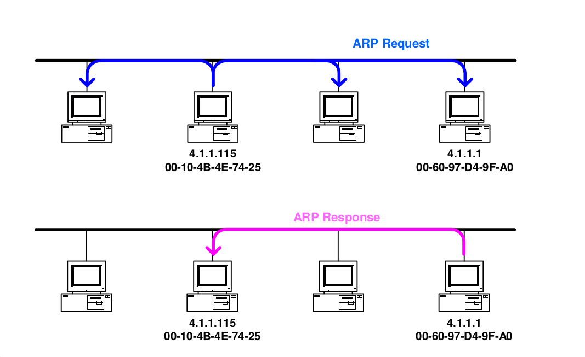

# ARP - Address Resolution Protocol

## Porque é preciso?
Imaginemos a seguinte situação

> Sei o endereço de _hardware_ e tenho pacotes de IP para entregar a um dado destinatário. Como é que mapeio um no outro, ou seja, como é que através do endereço IP do pacote recebido sei o _MAC address_ para onde devo enviar?

Uma solução simples seria fazer o `broadcast` do pacote pela rede. Esta solução não é prática porque obriga a que:

- Todos os dispositivos na rede recebam o pacote
- Todos os dispositivos tenham de abrir o pacote
- Processá-lo
- Perceber se se destina ou não ao seu endereço IP
	- Se não, descartar o pacote
	- Se sim, continuar a processar o pacote

Esta metodologia apenas funciona para os `hubs`, porque estes apenas têm de efetuar o `broadcast` da informação. Não pode ser utilizada em dispositivos terminais, como computadores, porque obriga a que cada pacote da rede seja processado.

## Solução
- `ARP`: _Address Resolution Protocol_
- É efetuado um pedido à rede, fazendo um `broadcast`, para saber quem sabe o `MAC address` de um dado endereço IP
	- **ARP Request**
- Se alguém na rede possuir na sua tabela de ARP, uma ligação entre o IP enviado no **ARP Request** e o `MAC address`:
	- envia uma **ARP Response** para o terminal/router que enviou o pedido, indicando o `MAC address` para o dado `IP`
- A estação que efetuou o `ARP Request` guarda a informação que recebeu na sua **tabela de ARP**

## Objetivo do ARP:
- Descobrir se um terminal/router com um dado endereço de IP se encontra ligado na rede
- Permite a construção da frame de Ethernet com os endereços MAC de origem e destino corretos, usando a tabela de ARP

		

- Um **ARP Request** é sempre `broadcast`
- Uma **ARP Response** **não é** `broadcast`
- É identificado com o `Protocol Type 800`
- É inserido numa frame de `Ethernet`
- O `MAC address` representa o endereço físico
- O `IP address` representa o endereço lógico
- Sempre que existe uma comunicação entre duas máquinas, a tabela de ARP é atualizada

## Problemas e Limitações
- Só pode ser usado em **redes locais**
	- Não é o mecanismo usado na Internet

