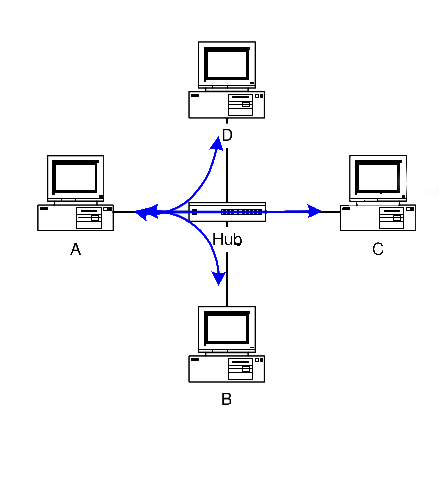
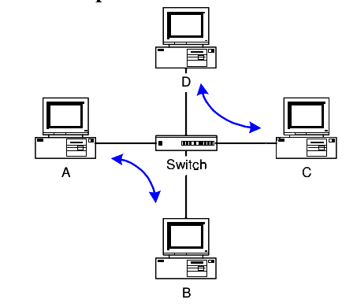
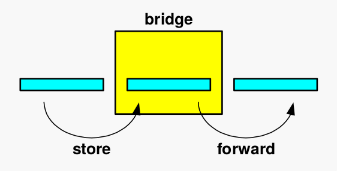
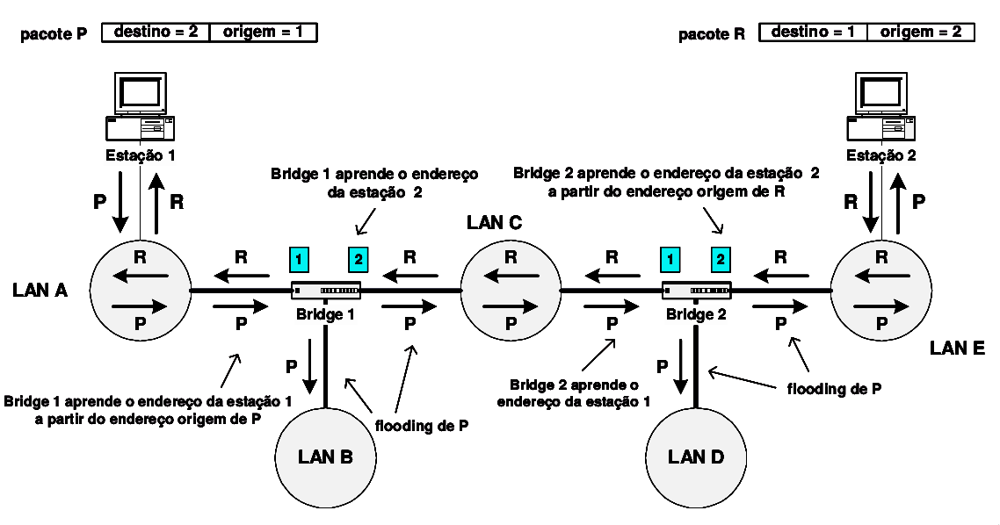

# Hubs vs Switches

## Repeaters/Hubs
- Um repetidor numa rede de telecomunicações opera como um descodificador + amplificador
	- Descodifica a informação que lhe chega
		- Amostra
		- Quantifica
		- Converte de analógico para digital
	- Amplifica
		- Amplifica a potência do sinal
		- transmite
- Opera na **1ª  camada**, **bit a bit**
- Unidade de operação/trabalho: bit
- Implica que o meio só possa ser **usado** por uma estação de cada vez
- Interligam segmentos do mesmo tipo de LANs, i.e., interligam diferentes segmentos da mesma LAN
- A largura de banda agregada é limitada pela taxa de transmissão da LAN
- Os bits vão sendo transmitidos à medida que vão chegando
- A bitrate é partilhada globalmente

## Bridges/Switches
- Analiso o pacote quando chega
	- Tomo decisões com base no destinatário
		- Se o destinatário está na mesma porta que o emissor, não envio o pacote para mais nenhuma porta
		- Se o destinatário esta na porta x, que não coincide com a mesma porta que o emissor, envio para apenas para a porta x
	- método de `Store and Forwarding` + `Filtering` aos pacotes
		- Selectividade da porta de destino
		- Permite que as portas operem a diferentes taxas de transmissão
		- Não envia os pacotes para uma porta se não precisar de o fazer
- Unidade de operação/trabalho: pacote
- Interligam diferentes `LANs`
- Mais complexos que os `repeaters`/`hubs`
- Um switch é uma `bridge` _multiple port_  
- Um switch possui a noção de estados

## Bridges/switches vs repeaters/hubs
Vantagens de usar bridges/switches:

- As colisões deixam de ser um problema
- A largura de banda é agregada e não é limitada pela taxa de transmissão das portas
	- Desde que não se conectem LANs, a largura de banda é multiplicada
- Várias estações podem transmitir em simultâneo se o seu emissor e destinatário forem diferentes

## Bridges

### Address Learning

1. A estação 1 quer comunicar com a estação 2
2. Envia um pacote P para a LAN A
3. O pacote P chega à bridge 1
4. A bridge 1 aprende o endereço da estação 1, usando o `source MAC address` do pacote P
4. A bridge 1, que desconhece o endereço da estação 2, efetua um `flooding` do pacote P
5. O pacote P é enviado para a LAN B, de onde não obtém resposta
6. O pacote P é enviado para a LAN C, chegando à bridge 2
8. A bridge 2 aprende o endereço da estação 1, usando o `source MAC address` do pacote P
9. A bridge 2 não conhece o endereço de destino do pacote P
10. A bridge 2 efetua o flooding de P para a LAN D e para a LAN E
11. Na LAN E está ligada a estação de destino, que reconhece o seu endereço MAC
12. A estação 2 responde ao pacote P recebido, enviando o pacote R
13. A bridge 2, como já conhece o endereço de destino, faz o `forwarding` do pacote R da LAN E para a LAN C
	- A LAN D nunca vai receber o pacote R, porque a `bridge 2` sabe qual a porta para onde deve encaminhar os endereços para a estação 1
14. A bridge 1, como já conhece o endereço de destino, faz o `forwarding` do pacote R para para a LAN A
15. A estação 1, ligada à LAN A, recebe o pacote de destino

Quando uma bridge recebe uma trama MAC numa porta de entrada:

- regista na sua tabela de encaminhamento a **porta** em que recebeu a trama e o **endereço MAC** de origem da trama 
- procura o endereço MAC de destino na **trama** da tabela de encaminhamento, para reencaminhar a trama
- se não tiver o endereço de destino efetua `flooding`
- Se tiver o endereço MAC
	- Se for na mesma interface, descarta o pacote
	- Se for noutra interfacem, efetua `forwarding`

- `flooding`: broadcast de um pacote para todas as portas do `switch`, exceto a de origem do pacote, quando este desconhece a porta que deve usar para atingir o endereço de destino. É um processo que é efetuado para o `switch` aprender a que porta se encontra ligada a LAN que contém uma estação com o endereço MAC de destino do pacote. Só acontece quando a tabela de encaminhamento do switch não possui o endereço MAC de destino na sua tabela de encaminhamento. Comporta-se como um repetidor
- `forwarding`: encaminhamento de um pacote de uma porta do `switch` para outra porta do `switch`, usando a porta indicada na tabela de encaminhamento do switch. A bridge envia apenas a trama pela porta registada na tabela.

#### Tabela de Encaminhamento
endereço MAC  interface  tempo de vida
------------ ---------- ---------------
   -              -          -

: Exemplo da organização das tabelas de encaminhamento nos switches

#### TTL - Time to Live of a MAC Address Table ENtries

Após a troca da estação 2 da LAN E para a LAN D, a estação 2 deixa de receber pacotes porque as entradas das tabelas de switch das bridges continuam a indicar que devem enviar os pacotes para a LAN E.

As tabelas de encaminhamento só vão ser atualizadas se:

- a estação 2 transmitir
- o tempo de vida (`TTL`) das entradas na tabela de encaminhamento expirar
	- introduz-se mecanismos de aging no sistema
	- é uma forma de evitar bloquear um sistema que tem a noção de estado
	- se a bridge não receber nada da estação durante 30 segundos, remove-a 

