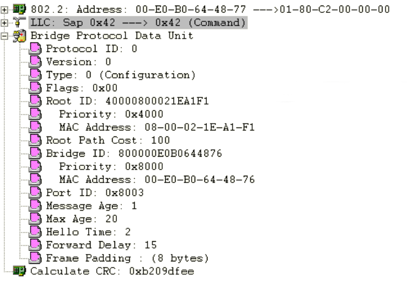

## Protocolo IEEE 802.1D
- Para construir e manter a spanning tree as brdiges trocam mensagens entre si
- Estas mensagens são desingadas de BPDUs - Bridge Protocol Data Units
- Existem dois tipos:
	1. Configuration 
	2. Topology Change Notification

O Header do pacote é apresentado na figura \ref{ieee_802_1d_header}

- `Destination`: endereço multicast atribuído a todas as bridges
- `Source`: endereço MAC da porta que enviou o BPDU
- `DSPAP` = `SSAP` = $0100010$ = $0x42$

Os campos mais importantes são:

- `Root ID`: estimativa atual do endereço da bridge raiz
- `Root Path Cost`: estimativa atual do custo para a bridge raiz
- `Bridge ID`: endereço da bridge que envia a mensagem de configuração
- `Port ID`: endereço da porta que envia a mensagem de configuração

