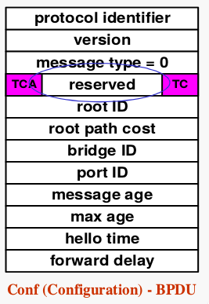

## Protocolos

### 802.1p
- extensão do IEEE 802.1Q
- permite mapear nos bit da ethernet prioridades
	- pode ser usado para qualidade de serviço
	- Campo `User Priority` (3 bits)
		- 8 níveis de prioridade

Prioridade  Descrição
---------- ------------
7            tráfego crítico de gestão de rede
5-6          tráfego sensível ao atraso (e.g., voz e vídeo)
1-4          tráfego sensível à variação do atraso (streaming)
0				 restante tráfego (e.g., transferência de ficheiros)

: Recomendações do uso de prioridades da norma

### 802.1w Rapid Spanning Tree Protocol
- extensão do IEEE 802.1D
- Acelera o ponto de convergẽncia relativamente ao 802.1D
	- mais rápido a convergir
- Altera os estados e funções de cada porta
- Introduz um mecanismos de negociação entre bridges
- usa os bits entre as flags TCA e TC
	- bits entre o `topology change` e o `topology change adverstiment` que permite às bridges convergir mais rapidamente
- Mais informação: [Understanding Rapid Spanning Tree Protocol (802.1w)](http://www.cisco.com/warp/public/473/146.html)

### 802.1s - Multiple Spanning Tree Protocol
- O STP e RSTP não reconhecem VLANS
	- Primeiro é necessário estabelecer as spwanign tree
	- Ao criar as VLANs fecho portas nas spanning trees
	- Se existir tráfego nas VLANs não devia haver problema
	- Se as bridges não tiverem tráfego na altura de criação das VLANs, vamos ter problemas
	- Uma vez que as VLANs estão separadas, não vai ser possível criar uma spanning tree unica
- este protocolo trata de criar as spwaning trees asssociadoas as vlans
- Permite criar múltiplas Spanning Trees e atribuir cada VLAN a uma das Spanning Trees criadas
- Usa os protocolos IEEE 802.1W (VLANs) e IEEE 802.1w (RSTP)
- Permite criar **múltiplas regiões**
	- Fora das regiões funciona como o protocolo IEEE 802.1D
- Mais informação: [Understanding Multiple Spanning Tree Protocol (802.1s)](http://www.cisco.com/warp/public/473/147.html)

