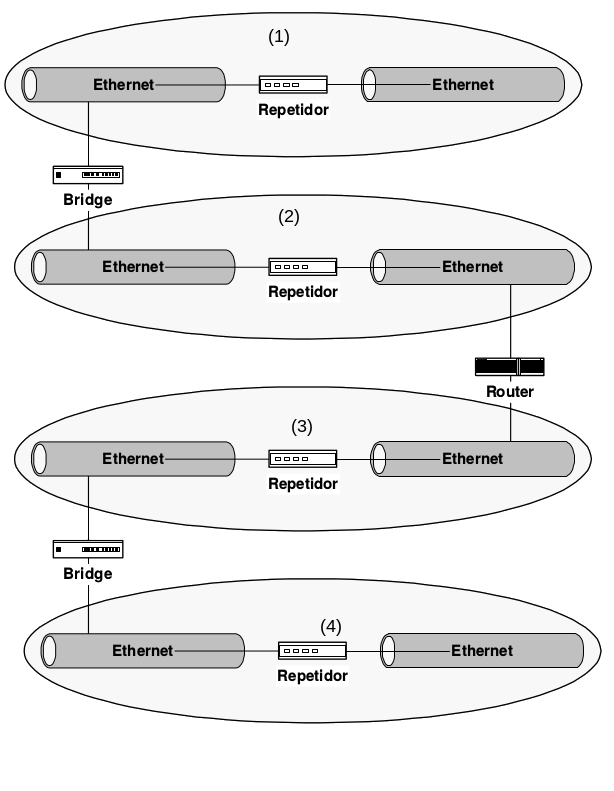
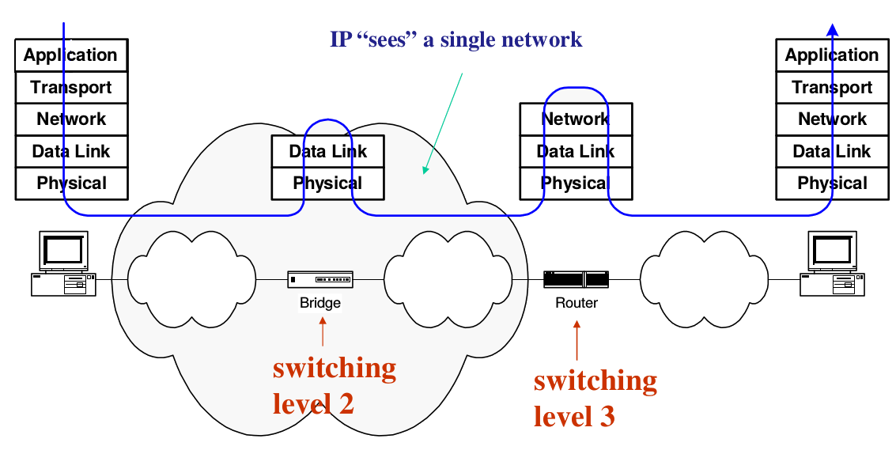
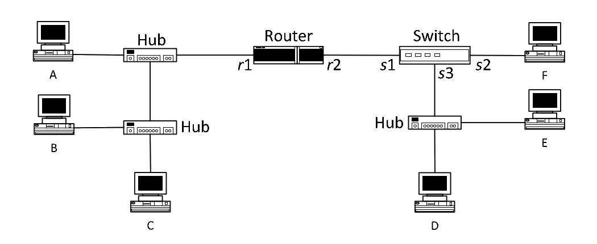

# Interconexão de LANs

- A LAN 1 e a LAN 2 pertencem ao mesmo domínio de colisão
	- Estão na mesma camada de nível 2
- A LAN 3 e a LAN 4 pertencem ao mesmo domínio de colisão
	- Estão na mesma camada de nível 2
- Os segmentos de Ethernet, dentro de cada LAN, estão ligados por um repetidor, por isso recebem os mesmos pacotes
- O router separa duas redes IP diferentes
	- com diferentes domínios de `broadcast`

Através da figura \ref{routers_vs_switches}, são apresentadas as camadas do protocolo OSI em que operam as bridges e os routers.

## Routers
- Opera na camada 3
	- Camada IP
	- Nível da rede
- Efetua `level 3` _`"switching"`_
	- O termo correto é `routing`
- tipo `store and forward`
- Comuta com base nos endereços de nível 3
	- IP
	- IPX
	- AppleTalk
	- etc.

## Domínios de colisão e `broadcast`

Na figura \ref{collision_and_broadcast_domains} existem 

- Dois domínios de `broadcast`:
	- A, B, C  e $r_1$
	- D, E, F e  $r_2$
- Dois domínios de colisão:
	- interfaces `full-duplex`
		- A, B, C, e $r_1$
		- D, E e $s_3$
	- interfaces `half-duplex`
		- A, B, C, $r_1$, D, E, $s_3$
- Não existem colisões entre as interfaces
	- se forem `full-duplex`
		- ($r_2$, $s_1$) 
		- ($s_2$, F)

Os pacotes só atravessam o switch se:

- forem `unicast` para a `bottom layer`
- forem `broadcast`

### Como é que os switches respondem a colisões?
- `Full-duplex`:
	- As entidades são capazes de comunicar ao mesmo tempo
	- não ocorre conflito
- `half-duplex`:
	- Sou capaz de ou ouvir ou falar
	- Se um dispositivo fala, os outros ouvem
	- Podem ocorrer confiltos
		- Duas estações a tentarem comunicar para o mesmo destino ao mesmo tempo

- Se a linha estiver cheia, os pacotes não são enviados
	- $\implies$ Saturação do link na rede
	- $\implies$ buffer enche
	- $\implies$ Data é perdida

