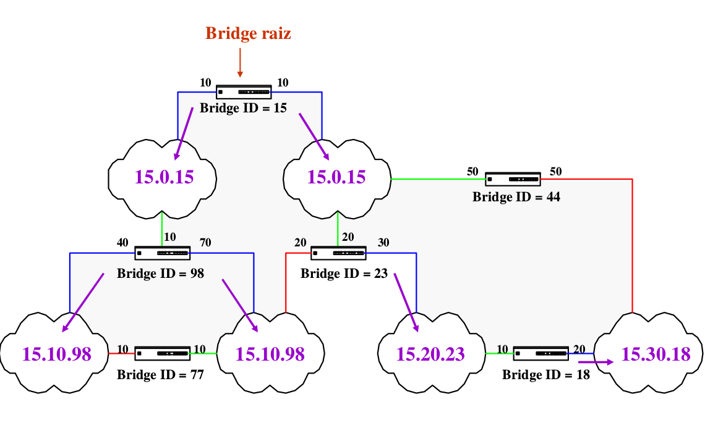
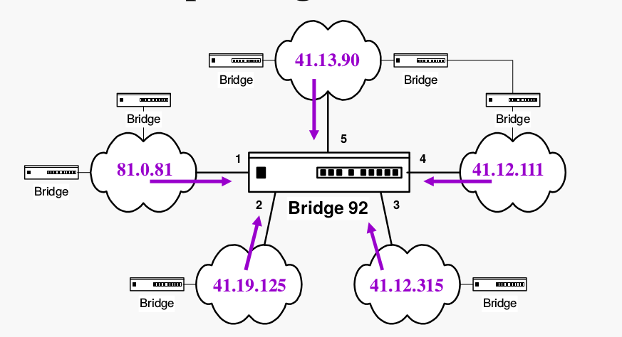
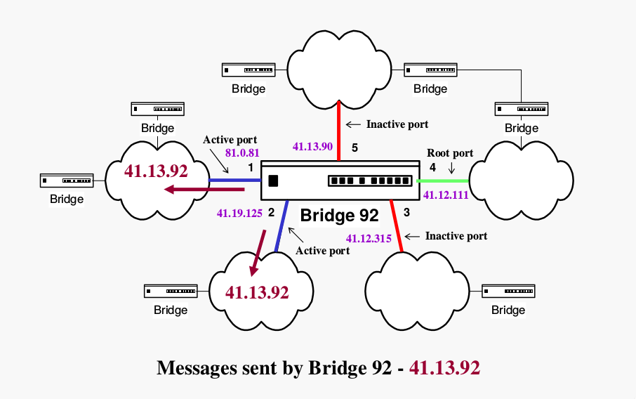
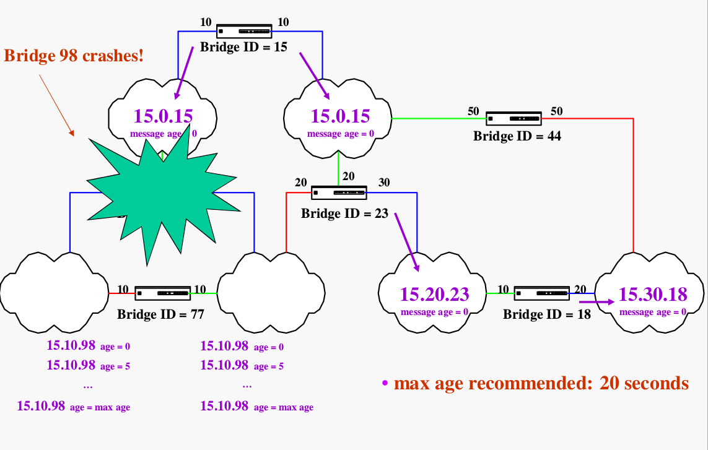
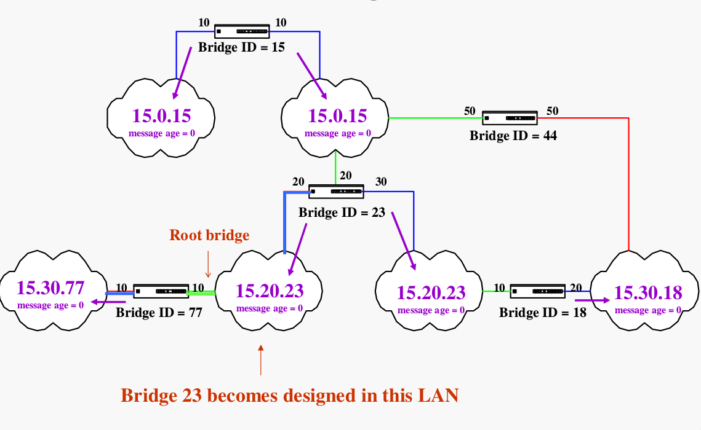

## Manutençao da Spanning Tree

- Convenção para Configuration-BPDUs:
	- `root bridge`
	- `root path cost`
	- `bridge ID`
- Periodicidade das Configuration-BPDUs = _hello time_
	- _hello time_ recomendado: 2 seg

### Order of configuration messages
Uma mensagem de configuração $C_1$ dize-se melhor que outra, $C_2$, se:

1. o `root ID` de $C_1$ for inferior ao de $C_2$
2. Se os dois `root IDs` forem iguais, o `root path cost` de $C_1$ for inferior ao de $C_2$
3. Se os `root IDs` e `Root Path Cost` forem idênticos, o `bridge ID` de $C_1$ for inferior ao de $C_2$
4. Sendo idênticos os `root IDs`, `root path cost` e `bridge ID`, o `Port ID` de $C_1$ for inferior ao de $C_2$

Root ID     Root Path Cost   Bridge ID   Port ID
--------  ----------------- ----------- ----------
18           27               32           2
18           27               32           4
18           27               43           1
18           35               23           3
18           31               45           2

:Table que mostra a ordenação, do melhor para o pior, das mensagens de configuração

## Construção da Spanning Tree

1. Cada bridge assum inicialmente que é a bridge raiz
	- `root path cost` = 0
	- Envia mensagens de configuração em todas as suas portas
	- figura \ref{spanning_tree_step_1}
2. As melhores mensagens recebidas pela bridge que enviou as mensagens de configuração permitem decidir qual a `root port`
	- Usam a estiamtiva do `root path cost` enviada por cada uma das bridges
	- o `root path cost` é igual à soma do custo da:
		- porta raiz da bridge 
		- `rooth path cost` da melhor mensagem de configuração recebida até ao instante
	- Através da figura \ref{spanning_tree_step_1}, podemos concluir que
		- O `root ID` mais baixo é 41, mas existem 4 bridges com este ID
		- O `root path cost` mais baixo é o 12, mas existem 2 bdiges com este `root path cost`
		- O `bridge ID` mais baixo é 111
		- Assim, na figura:
			- **bridge raiz** = 41
			- **porta raiz** = 4
			- **custo para a raiz** = 12 + 1 = 13, supondo que os custos das portas são todos unitários

- Quando um bridge recebe, na que julga ser a sua **porta raiz**, uma mensagem de configuração **melhor** que a mensagem de configuração que iria transmitir, com base nas suas estimativas atuais de `root ID` e `root path cost`, transmite essa mensagem de configuração em todas as portas em que **bridge designada**
- Quando uma bridge recebe **numa porta** uma mensagem de configuração **melhor** do que aquela que iria transmitir (com base nas suas estimativas actuais de **Root ID** e **Root Path Cost**), a bridge **cessa de transmitir mensagens de configuração nessa porta**
	- a porta passa ao estado `blocking`
- Quando uma bridge recebe numa porta uma mensagem de configuração **pior** do que aquela que iria transmitir (com base nas suas estimativas actuais de `Root ID` e `Root Path Cost`), a bridge **transmite a sua mensagem de configuração nessa porta**
	- este acontecimento pode ser visto na figura \ref{spanning_tree_step_3}

### Exemplo

1. A bridge 83 envia 83.0.83 em Eth1, Eth2 e Eth3
2. A bridge 21 envia 21.0.21 em Eth2 e Eth3 (83 fica a saber que não é raíz)
3. A bridge 83 envia 21.20.83 em Eth1 (porta raiz = 2)
4. A bridge 18 envia 18.0.18 em Eth1 e Eth3 (21 fica a saber que não é raíz)
5. A bridge 21 envia 18.20.21 em Eth2
6. Mas a bridge 83 tem uma mensagem melhor para a Eth2
7. A bridge 83 envia 18.10.83 em Eth2 (porta raiz = 1, Path Cost = 10)

O Algoritmo convergiu. No entanto, continuam a ocorrer um conjunto de operações periódicas.

- A bridge raiz envia periodicamente 18.0.18
- A bridge 83 retransmite com 18.10.83 em Eth2
- A bridge 83 é a bridge designada em Eth2 e a sua porta raiz é a 1.
- A porta 3 está inactiva.
- A porta 1 da bridge 21 está inactiva.
- A bridge 18, sendo a raiz, é a bridge designada em Eth1 e Eth3.

## Breakdown em bridges ou LANs

### Ciclos temporários
Após a alteração da topologia da rede, pode ocorrer:

- **perda temporária de conectividade:**
	- uma porta estava inativa na topologia antiga deve estar ativa na nova topologia
- **ciclos temporários:**
	- uma porta que estava ativa na topologia antiga deve estar inativa na nova topologia

De modo a evitar os ciclos tem+poraŕios que se podem estabelecer momentaneamente e fazer com que a rede crashe, quando ocorre a troca de otopologias, é necessário que as +portas esperem algum tempo antes de permitirem que uma das suas portas passe do estado inaivo p+ara ativo. Este tempo de espera denomina-se `forward delay`.

## Bridge Port States

- **estado `blocking`**
	- os processos de aprendizagem e de expedição de pacotes estão **inibidos**
	- recebe e processa **mensagens de configuração**
- **estado `listening`**
	- o processo de aprendizagem e expedição de pacotes estão **inibidos**
	- transita para o estado `learning` após um tempo de permanência neste estado ligado a `forward delay`
	- recebe e processa mensagens de configuração
- **estado `learning`**
	- o processo de aprendizagem está **activo**
	- o processo da expedição de pacotes está **inibido**
	- transita para o estado forwarding após um tempo de permanência neste estado igual a `forward delay`
	- recebe e processa mensagens de configuração
- **estado `forwarding`**
	- **estado ativo**
		- processo de aprendizagem ativo 
		- processo de expedição de pacotes ativo
	- recebe e processa mensagens de configuração
- **estado `disabled`**
	- **estado inativo**
		- processo de aprendizagem inativo 
		- processo de expedição de pacotes inativo
	- Não participa no algoritmo da spanning tree

