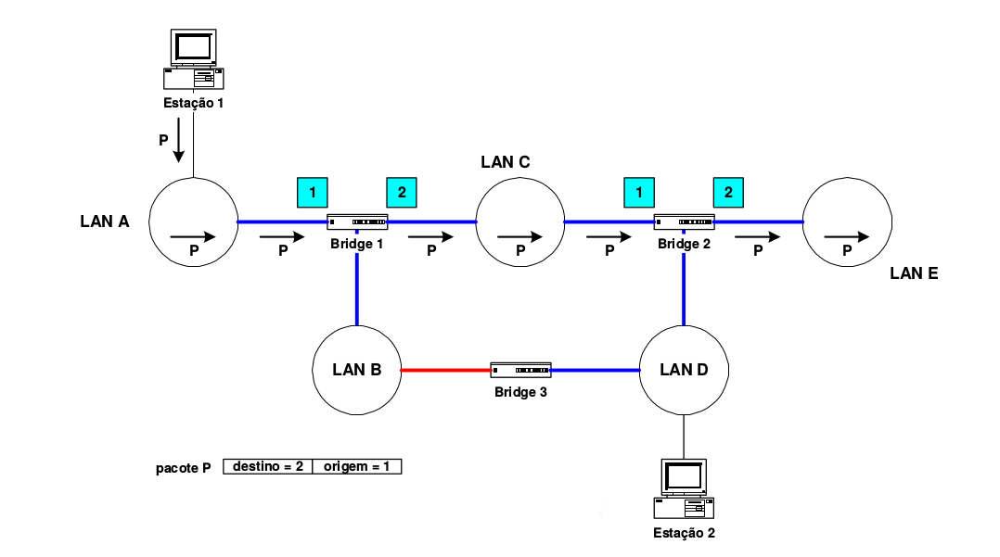
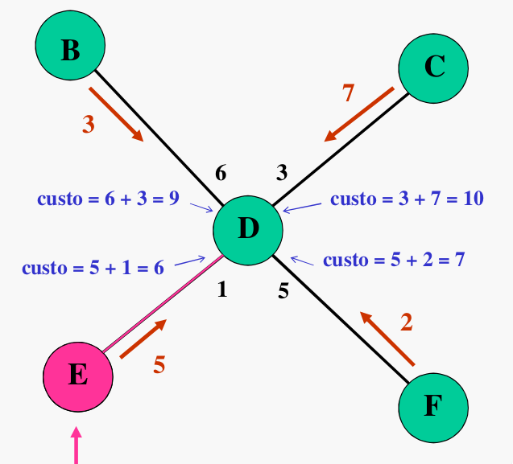
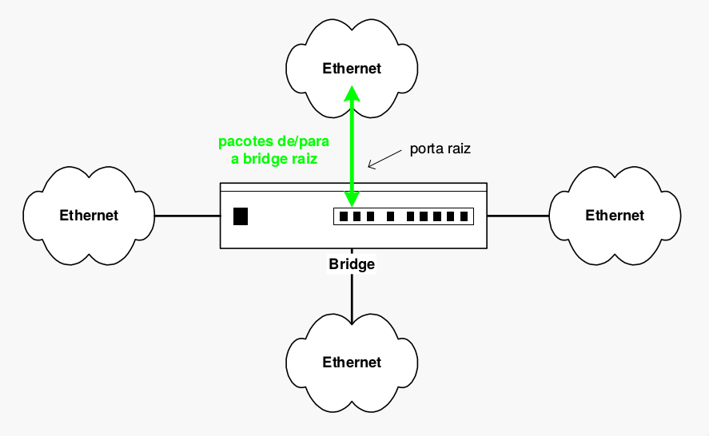

---
header-includes:
	- \usepackage{float}
	- \usepackage{subfig}
	- \usepackage{graphicx}
	- \usepackage{amsmath}
	- \usepackage{arcs}
...
# Spanning tree
- **Objetivo:** Numa rede que pode ter ligações redundantes entre switches, escolher que portas usar para efetuar as ligações entre várias LANs

1. A estação 1 quer comunicar com a estação 2
2. Envia um pacote P para a LAN A
3. O pacote P chega à bridge 1
4. A bridge 1 aprende o endereço da estação 1, usando o `source MAC address` do pacote P
4. A bridge 1, que desconhece o endereço da estação 2, efetua um `flooding` do pacote P
5. O pacote P é enviado para a LAN B
6. Na LAN B, o pacote não é enviado pela bridge 3 porque a porta ligada à LAN B está inativa, em resultado do algoritmo da Spanning Tree
6. O pacote P é enviado para a LAN C, chegando à bridge 2
8. A bridge 2 aprende o endereço da estação 1, usando o `source MAC address` do pacote P
9. A bridge 2 não conhece o endereço de destino do pacote P
10. A bridge 2 efetua o flooding de P para a LAN D e para a LAN E
11. Na LAN D, a bridge 3 aprende o endereço da estação 1
11. Na LAN E está ligada a estação de destino, que reconhece o seu endereço MAC
12. A estação 2 responde ao pacote P recebido, enviando o pacote R
13. A bridge 2, como já conhece o endereço de destino, faz o `forwarding` do pacote R da LAN E para a LAN C
	- A LAN D nunca vai receber o pacote R, porque a `bridge 2` sabe qual a porta para onde deve encaminhar os endereços para a estação 1
14. A bridge 1, como já conhece o endereço de destino, faz o `forwarding` do pacote R para para a LAN A
15. A estação 1, ligada à LAN A, recebe o pacote de destino

Após a troca da estação 2 da LAN E para a LAN D, a estação 2 deixa de receber pacotes porque as entradas das tabelas de switch das bridges continuam a indicar que devem enviar os pacotes para a LAN E.

O protocolo de spanning tree vai entrar em ação, indicando que a entrada na rede deixou de ser válida para atingir o endereço pretendido, desencadeando os mecanismos necessários para ocorrer as mudanças nas tabelas de encaminhamento.

As tabelas de encaminhamento só vão ser atualizadas se:

- a estação 2 transmitir
- o tempo de vida (`TTL`) das entradas na tabela de encaminhamento expirar por `time-out` do contador do spanning tree
	

No protocolo Spanning Tree, os nós da rede estão constantemente a aprender o estado da rede. As entradas da tabela de encaminhamento tem uma validade que força a atualização da informação sobre a rede.

A validade das entradas pode ser curta ou longa:

- validade curta
	- 	quando recomeça a transmitir após um intervalo de tempo, irá ser necessário ocorrer `flooding`
- 	validade longa
	- 	quanto se efetua mudanças da máquina entre LANs, esta vai ficar sem coenctividade

Tipicamente, usam-se dois `timings`:
	
- Um para situações de atualização da `spanning-tree`
- Outro para situações de timeout normais da `spanning tree`

Numa situação normal de `time-out`, normalmente as entradas tem um timeout de $\approx$ 5 minutos. Na prática, o valor pode ser diferente, mas é raro obter valores inferiores a 2 min.

Quando a `spanning tree` está em configuração, as spwaning tree sao caluldas de forma diferente em funçãão da raiz da mesma. Não ocorre mudança das máquinas, mas a forma como chega às várias estações é diferente.

A validade de cada uma das entradas é mais curto do que o habitual (normalmente 15 seg). Quando ocorre uma mudança existe um pacote próprio:

-  TCN - Topology Change Notification
	- 	5 min - as tabelas demoram algum tempo a serem limpas
	- 	em termos práticos é difícil ver menos de 2 min 
	
Podemos ter uma spanning tree que é "ineficiente". 
A `spanning tree` procura o camninho mais curto, não o mais estável. 

- por vezes o caminho mais curto não é o mais estável
- não é objetivo do SPT, (Spawning tree protocolo) descobrir o cmninhos mais rápido

## Protocolos
- 802.1p
	- permite mapear nos bit da ethernet prioridades
- 802.1w
	- rapid spanning tree protocol
	- Acelera o ponto de convergẽncia relativamente ao 802.1D
	- bits entre o `topology change` e o `topology change adverstiment` que permite às bridges convergir mais rapidamente
- 802.1s - Multiple Spanning Tree Protocol
	- O STP e RSTP não reconhecem VLANS
	- Primeiro é necessário estabelecer as spwanign tree
	- Ao criar as VLANs fecho portas nas spanning trees
	- Se existir tráfego nas VLANs não via haver problema
	- Se as bridges não tiverem tráfego na altura de criação das VLANs, vamos ter problemas
	- Uma vez que as VLANs estão separadas, não vai ser possível criar uma spannign tree unica
	- este protocolo trata de criar as spwaning trees asssociadoas as vlans

## Bellman Equations

Quando os custos das ligações são não-negativos, temos:

\begin{align*}
Comprimento do percurso mínimo de um nó X para A & = Comprimento mínimo de X até ao nó que liga esse nó ao nó A \\
																 & + Comprimento do percurso minimo desse nó para A
\end{align*}																 

O algoritmo de Bellman-Ford caracteriza-se por ser:

- Distribuído
- Assíncrono

- Cada nó transmite a sua estimativa de custo, $D_j$, para os seus vizinhos, de um intervalo de tempo definido em um intervalo de tempo definido
- Com uma cadência definida, cada nó $ i \neq 1$, a cada iteração, usando as suas últimas estimativas para $D_j$ e a informação mais recente sobre o seu estado e o comprimento das suas ligações de saída, calcula $$D_i = min(d_{ij} + D_j$$

## Forwarding baseado em Spanning Trees
- É escolhida uma brdige como nó de origem
- As outras bridges usam o algoritmo de Bellman-Ford assíncrono e distribuído
	- Calculam para decidir qual o nó vizinho que devem usar 
	- O percurso escolhido deve ter o custo míbimo para o nó origem
- As ligações compostas pelos percursos de **custo mínimo** (de todas as bridges para a origem), definem uma spanning tree [^1]
- Só as portas ativas é que compõem as ligações da `spanning tree`
- É necessário um critério para desempatar quando há múltiplos percursos de curso mínimo

\begin{center}
	\begin{figure}
		\subfloat[Gráfico da rede]{\includegraphics[width= 0.25\textwidth]{../pictures/spanning_tree_example.png}}
		\hfill
		
		\subfloat[1º exemplo de uma spanning tree possível]{\includegraphics[width= 0.25\textwidth]{../pictures/spanning_tree_example_1.png}}
		\hfill
		
		\subfloat[2º exemplo de uma spanning tree possível]{\includegraphics[width= 0.25\textwidth]{../pictures/spanning_tree_example_2.png}}\\
		\hfill
		
		\subfloat[3º exemplo de uma spanning tree possível]{\includegraphics[width= 0.25\textwidth]{../pictures/spanning_tree_example_3.png}}
		\hfill
		
		\subfloat[4º exemplo de uma spanning tree possível]{\includegraphics[width= 0.25\textwidth]{../pictures/spanning_tree_example_4.png}}
		\hfill
		
		\subfloat[5º exemplo de uma spanning tree possível]{\includegraphics[width= 0.25\textwidth]{../pictures/spanning_tree_example_5.png}}\\

		\caption{Exemplo de uma rede e múltiplas spanning trees possíveis} \label{fig:1}
	\end{figure}
\end{center}

[^1]: árvore abrangente

## Funcionamento da Spanning Tree
[Exemplo do funcionamento da Spanning Tree](../pictures/spanning_tree_basics.png)

- `Bridge ID`: cada bridge é identificada por um endereço que contém:
	- 2 octetos de prioridade
	- configuráveis pelo gestor de rede
		- 6 octetos fixos
	- Um dos endereços MAC das portas da bridge
		- QUalquer outro endereço único de 48 bits
	- A prioridade possui precedência sobre o campo de octetos fixos
- `Bridge raiz` _(root bridge)_: 
	- bridge que está na raiz da spanning tree
	- bridge com menor bridge ID
- `Path cost`:
	- custo associado a cada porta da bridge
	- pode ser configuado pelo gestor de rede
- `Designated Birdge` _(bridge designada)_:
	- bridge que numa LAN é responsaǘel pelo envio de pacotes da LAN para a bridge raiz e vice-versa
	- a bridge raiz é a bridge designada em todas as LANs a que está ligada
	- ver figura \ref{designated}
- `Designated Port` _(porta designada)_:
	- porta que numa LAN é responsável pelo envio de pacotes da LAN para a bridge raiz e vice-versa
	- uma das portas da bridge designada
	- ver figura \ref{designated}
	- **em cada LAN**, a porta que fornece o **melhor percurso** (menor custo) para a raiz
- `root port` _(porta raiz)_ 
	- porta que numa bridge é responsável pela receção/transmissão de pacotes de/para a brdige raiz
	- figura \ref{root_port}
	- em **cada brdige**, a porta que fornece o **melhor percurso** (menor custo) para a raiz

Cada bridge tem associado a si um **custo do percurso para a raiz (`Root Path Cost`)** igual à soma dos custos das portas que recebem pacotes enviados pela raiz (portas raiz) no percurso de menor custo para a bridge. Ver figura \ref{root_path_cost}.

As **portas ativas** em cada bridge são a **porta raiz** e as **portas designadas**. As restantes portas estão **inativas** _(blocking)_

### Exemplo de Mudança
1. Uma porta passa ao estado blocking
2. A bridge que perdeu conectividade envia um TCN 
3. A partir desse momento, a bridge acima recebeu o TCN 
4. Envia um TCA - Topology CHange Ack para a outra bridge, a informar que já sabe que a ligação não existe
5. Envia um TCN na sua root port para outra bridge
6. O processo repete-se até chegar à raiz da rede
7. A raiz envia um BPDU com um TC - Toplogy Change
8. Os bridges mudam o timeout de reconfiguração
9. A reconfiguração aocntece
10. As spanning trees são atualizadas

