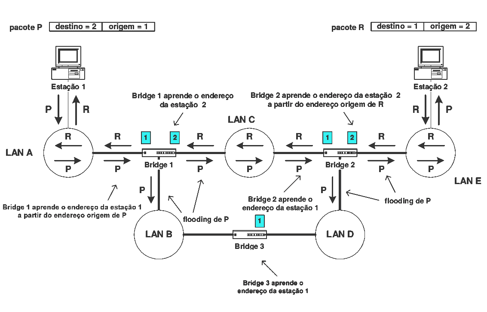

# VLANs - Virtual LANs
- No mesmo `switch` posso declarar a existência de diferentes VLANs
- Duas VLANs diferentes nunca comunicam entre si
	- são totalmente independentes
	- não estão na mesma rede
	- não é possível fazer ping
- é necessário criar ligações físicas entre as VLANs, usando um router
- Se nunca quiser ligar dispositivos entre VLANs diferentes, posso possuir os mesmos endereços locais
-

## Ligação entre switches
- ou usa uma porta física, figura \ref{physical_interswitching}
- requer uma porta física especial, `interswitch port`, figura \ref{interswitch_port}
	- protocolo IEEE802.1Q
	- requer o uso de `VLAN tags`
		- permitem identificar diferentes VLANs, através do VLAN ID 
		- permite multiplexar temporalmente a informação no mesmo cabo

### IEEE802.1Q Standard

### Redudância
A interligação de bridges/switches com redudância permite dotar a rede de mecanismos de **recuperação de falhas na ede**. 

No entanto, pode trazer problemas ao criar mecanismos de feedback positivo na rede, como por exemplo, o colapso das ligações devido à saturação na rede se ocorrer um broadcast

## Spanning tree
- **Objetivo:** Numa rede que pode ter ligações redundantes entre switches, escolher que portas usar para efetuar as ligações entre várias LANs

1. A estação 1 quer comunicar com a estação 2
2. Envia um pacote P para a LAN A
3. O pacote P chega à bridge 1
4. A bridge 1 aprende o endereço da estação 1, usando o `source MAC address` do pacote P
4. A bridge 1, que desconhece o endereço da estação 2, efetua um `flooding` do pacote P
5. O pacote P é enviado para a LAN B
6. Na LAN B, o pacote não é enviado pela bridge 3 porque a porta ligada à LAN B está inativa, em resultado do algoritmo da Spanning Tree
6. O pacote P é enviado para a LAN C, chegando à bridge 2
8. A bridge 2 aprende o endereço da estação 1, usando o `source MAC address` do pacote P
9. A bridge 2 não conhece o endereço de destino do pacote P
10. A bridge 2 efetua o flooding de P para a LAN D e para a LAN E
11. Na LAN D, a bridge 3 aprende o endereço da estação 1
11. Na LAN E está ligada a estação de destino, que reconhece o seu endereço MAC
12. A estação 2 responde ao pacote P recebido, enviando o pacote R
13. A bridge 2, como já conhece o endereço de destino, faz o `forwarding` do pacote R da LAN E para a LAN C
	- A LAN D nunca vai receber o pacote R, porque a `bridge 2` sabe qual a porta para onde deve encaminhar os endereços para a estação 1
14. A bridge 1, como já conhece o endereço de destino, faz o `forwarding` do pacote R para para a LAN A
15. A estação 1, ligada à LAN A, recebe o pacote de destino

Após a troca da estação 2 da LAN E para a LAN D, a estação 2 deixa de receber pacotes porque as entradas das tabelas de switch das bridges continuam a indicar que devem enviar os pacotes para a LAN E.

O protocolo de spanning tree vai entrar em ação, indicando que a entrada na rede deixou de ser válida para atingir o endereço pretendido, desencadeando os mecanismos necessários para ocorrer as mudanças nas tabelas de encaminhamento.

As tabelas de encaminhamento só vão ser atualizadas se:

- a estação 2 transmitir
- o tempo de vida (`TTL`) das entradas na tabela de encaminhamento expirar por `time-out` do contador do spanning tree
	

No protocolo Spanning Tree, os nós da rede estão constantemente a aprender o estado da rede. As entradas da tabel a de encaminhamento tem uma validade que força a atualização da informação sobre a rede.

A validade das entradas pode ser curta ou longa

- validade curta
	- 	quando recomeça a transmitir após um intervalo de tempo, irá ser necessário ocorrer `flooding`
- 	validade longa
	- 	quanto se efetua mudanças da máquina entre LANs, esta vai ficar sem coenctividade
	
Tipicamente, usam-se dois timings:
	
- Um para situações de atualização da `spanning-tree`
