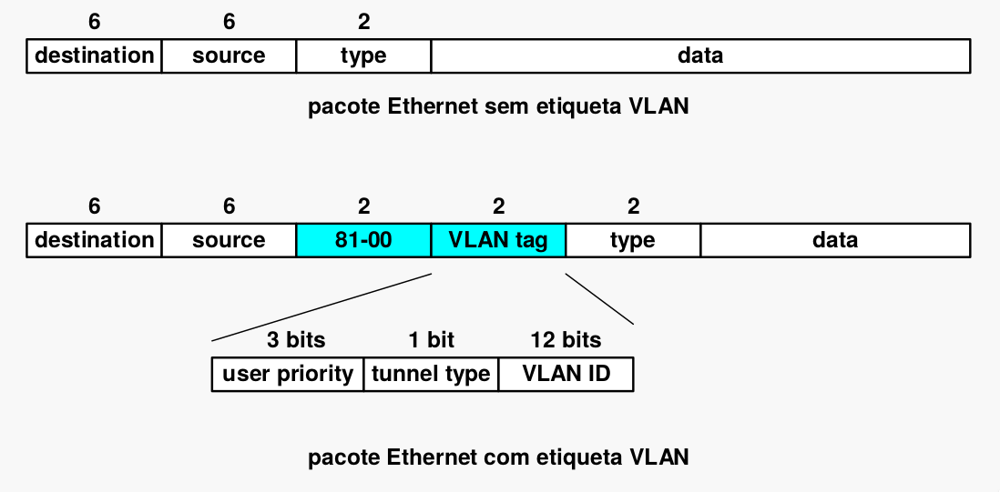

# VLANs - Virtual LANs
- No mesmo `switch` posso declarar a existência de diferentes VLANs
- Duas VLANs diferentes nunca comunicam entre si
	- são totalmente independentes
	- não estão na mesma rede
	- não é possível fazer ping
- é necessário criar ligações físicas entre as VLANs, usando um router
- Se nunca quiser ligar dispositivos entre VLANs diferentes, posso possuir os mesmos endereços locais
-

## Ligação entre switches
- ou usa uma porta física, figura \ref{physical_interswitching}
- requer uma porta física especial, `interswitch port`, figura \ref{interswitch_port}
	- protocolo IEEE802.1Q
	- requer o uso de `VLAN tags`
		- permitem identificar diferentes VLANs, através do VLAN ID 
		- permite multiplexar temporalmente a informação no mesmo cabo

### IEEE802.1Q Standard

### Redudância
A interligação de bridges/switches com redudância permite dotar a rede de mecanismos de **recuperação de falhas na ede**. 

No entanto, pode trazer problemas ao criar mecanismos de feedback positivo na rede, como por exemplo, o colapso das ligações devido à saturação na rede se ocorrer um broadcast

