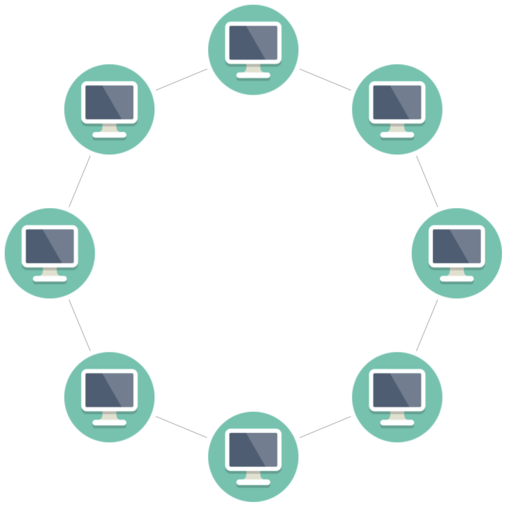
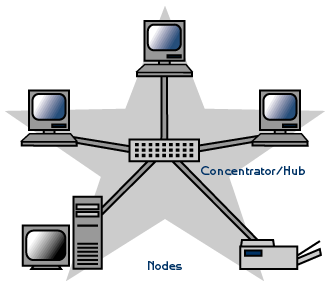

# Redes de Comunicação
São formadas principalmente por:

- Nós de switching
- Ligações ponto a ponto
- Equipamentos terminais
- Ligações partilhadas

## Ligações ponto a ponto
As ligações ponto a ponto representam uma **ligação física** entre dois dispositivos.

As ligações ponto a ponto trazem a vantagem de permitirem a otimização de cada conexão para cada estação específica. NO entanto, à medida que o número de estações envolvidas aumenta, o número de ligações físicas necessárias aumenta de forma exponencial

Se tivermos N nós, iremos precisar de $\frac{N^2 - N}{2}$ conexões, o que para valores de N elevados, se torna impossível.

- Cada estação que é adicionada implica estabelecer mais $N - 1$ ligações novas, ou seja, todas as existentes.
- Cada conexão necessita de um cabo e de $N -1 $ interfaces.
- **Não é escalável**

## Network topologies
As topologias da rede podem ser **lógicas** ou **físicas**, podendo coexistir em diferentes níveis, ou estarem misturadas no mesmo nível.

- A topologia pode referir-se aos cabos e interfaces ou como estão organizadas as entidades logicamente
- Em certas tipologias físicas, existe um melhor mapeamento da organização lógica com a física

Diferentes tipologias representam diferentes formas de **distribuir** e **partilhar  recursos**. Existem 4:

1. `mesh`
2. `bus`
3. `anel`_(ring)_
4. `estrela`_(star)_

### Mesh
Todos os nós estão ligados a todos os outros. Só é usada em redes de pequena dimensão, em que o número de nodos é reduzido.

Pela natureza do meio de comunicação, a rede wireless é `mesh`

Em ligações físicas por cabo/fibra, é usada redes com 4 a 6 nós, principalmente, redes com alto débito, por exemplo, links de fibra ótica com 10 Gbit por segundo, que interligam vários operadores.

**Vantagens:**

- Existem vários recursos disponíveis

**Desvantagens:**

- Rede complexa
- Rede difícil de gerir

### Bus
- A ligação física é um **único cabo**, **partilhado entre todos**
	- significa que se o cabo se estragar, a rede é destruída
- Qualquer terminal do cabo que não esteja ligado a nenhuma interface precisa de ser terminado propriamente.
	- Senão ocorrem reflexões
	- Removendo um nó da rede, é muito provável que a rede deixe de funcionar
- A rede pode ser aberta para inserir mais um nó, mas até o nó ser inserido fica inoperacional
- Exemplo:
	- Ethernet através de um cabo coaxial

**Vantagens:**

- Apenas usa um único cabo, o que facilita as ligações à rede

**Desvantagens:**

- Debug **muito difícil**
	- Partindo da extremidade da rede
		- Terminamos a rede da primeira interface
		- vemos se funciona
	- Vamos de computador em computador, terminal em terminal até descobrir o problema
		- não posso usar divisão binária

### Ring
- Todas as máquinas são conectadas em anel

**Vantagens:**

- O tempo de serviço e de resposta é determinístico
	- é possível determinar quanto tempo um pacote demora até ser recebido
- A rede é fácil de controlar
- O mecanismo de acesso ao meio é especificado e pode ser escolhido

**Desvantagens:**

- Se o cabo é cortado/desconectado, a rede morre
- Requer o uso de mecanismos de _failsafe_
	- Tipicamente são usados dois cabos, para o caso de um estar danificado
- Gestão da rede pode ser complexa
- Requer que o 1º nó da rede esteja ligado ao último

### Star network
- Todas as conexões são de 1 para 1, ou seja, ponto a ponto
- Qualquer problema que ocorra na rede é sempre local
	- Excluindo os problemas que afetem o hub
	- Se o hub morre, a rede morre
	- Se um cabo tiver problemas, só o cliente desse cabo é que sofre
- Implica usar um cabo por máquina, $N$
	- Mais cabos que para o bus ($1$)
	- Menos cabos que para a mesh ($N^2$)
	- Representa um **compromisso**
- As redes de um hoje são +- assim
- **Fisicamente**, as redes implementadas hoje em dia são redes em estrelas
- Exemplo: Ethernet UTP

**Vantagens:**

- Fácil Instalação
- Não existem falhas na rede sempre que um dos terminais é desconectado
- Fácil identificar falhas
	- Fácil remover elementos com falhas da rede
- Melhor performance que um bus

**Desvantagens:**

- Utiliza um elemento central para controlar a rede (`hub` ou `switch`)
	- _single point of failure_: se o `hub`/`switch` falha, a rede toda falha
- Mais cabos e maior custo que um bus

### Tree networks
- Estrutura em árvore
	- folhas representam os nós da rede
	- tronco representam a linha de comunicação principal de alto débito: `backbone cable`. Pode ser implementado com:
		-`ring` de fibra ótica
		-`high speed concentrator`
		-`bus`
	- em cada ramo existe uma rede em estrela
		- cada nó está ligado a uma rede em estrela localmente
- Atualmente, os ramos são redes em estrela inserido em redes em estrela
- O maior problema quando falamos desta redes são o cabo e os conectores

**Vantagens:**

- Conexão ponto a ponto nos segmentos individuais
- Se o hub morrer, a rede está segura
- Muito fácil de gerir

**Desvantagens:**

- O tamanho de cada segmento está limitado pelo tipo de cabo a usar
- Se o cabo principal ou o `concetrator` falhar, a area local falha
- Difícil configuração
- Difícil implementação física

