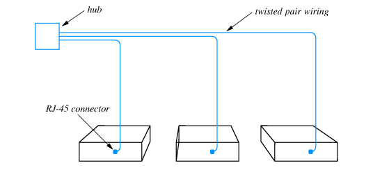

# Ethernet Evolution

## 10Base5
- Primeira tecnologia Ethernet
- Taxa de transmissão: 10 Mb/s
- Cabo coaxial grosso, $75 \Omega$ (_thick Ethernet_)
	- geralemnte amarelo
- Comprimento máximo do cabo = 500 m
- As estações conectavma-se á rede através de um _ransceiver_
- A interfacece entre as estações e o respetivo _ttransceiver_ é efetuada usando uma `AUI`
	 - `AUI`: Attachment Unit Interface
	 - Um cabo `AUI` podia ter no máximo um comprimento de 50 m
	 - A distância entre estações devia ser um múltiplo de 2.5m, para **evitar reflexões**
- O número máximo de estações permitidas são 100

### Limitações
Através da imagem \label{ethernet_transmission}, temos de garantir que todos os transmissores conseguem detetar colisões entre dois ou mais pacotes na rede. Isto impõe um **tamanho mínimo ao pacote**.

Para a configuração máxima, apresentada na figura \label{ethernet_10Base5_network}, usando cabos com o comprimento máximo de 50 m, e tendo em conta que o `round-trip delay` é de $52 \mu s$, podemos concluir que:

- o tamanho mínimo do pacote a ser transmitido possui 64 bytes
	- se o pacote possui menos dados $\implies$ _padding_ com '0'
- Os sinais/pacotes não podem ultrapassar mais do que:
	- **5 segmentos de cabo**
	- **4 repetidores**

## 10Base2
- Taxa de transmissão: 10 Mb/s
- Cabo coaxial fino, $50 \Omega$ (_thin Ethernet_)
- Comprimento máximo do cabo = 185 m
- As estações conectavma-se á rede/cabo através de um conector BNC
	 - A distância mínima entre devia ser 0.5m, para **evitar reflexões**
- O número máximo de estações permitidas por segmento são são 30
- Os segmentos tinham de ser interligados por um repetidor

## 10BaseT
- Primeiro protocolo estruturado
- Taxa de transmissão: 10 Mb/s
- Twisted Pair Winding (Cabo entraçado)
	- Pode ser `UTP` ou `STP`
		- `UTP`: Unshielded Twisted Pair
		- `STP`: Shielded Twisted Pair
- Comprimento máximo do cabo UTP = 100 m
- As estações conectava-se diretamente a um repetidor (`hub`), através de um cabo UTP
	- Conectores RJ-45
	- O cabo podia ter no máximo um comprimento de 100 m
- A rede física consistia num conjunto de cabos partilhados, onde todos os utilizadores partilha o mesmo meio físico
- Logicamente, a implementação é uma `star network`
	- **Mas não Fisicamente!**

### Hub operation
- Um hub é um repetidor que opera na camada física, efetuando o `broadcast` da informação de todas as portas para todas as portas

### Conectores RJ-45

#### Terminal Equipment

- Equipamento terminal são pcs ou routers
- **Pinos transmissão:** 1 e 2
- **Pinos receção:** 3 e 6 

#### Network Equipment

- Equipamento da rede são hubs e switchs
- **Pinos transmissão:** 3 e 6
- **Pinos receção:** 1 e 2 

### Cabos UTP
- Definição da Norma EIA/TIA-568B RJ-45:
	- **Par #1:** Branco/Azul + Azul
	- **Par #2:** Branco/Laranja + Laranja
	- **Par #3:** Branco/Verde + Verde
	- **Par #4:** Branco/ Castanho + Castanho
-  10BaseT apenas usa os **pares 2 e 3 (laraja e verde)**
	- **Par #2** é ligado aos pinos **1** e **2**
		- Pino 1: Branco/Laranja
		- Pino 2: Laranja
	- **Par #3** é ligado aos pinos **3** e **6**
		- Pino 3: Branco/Verde
		- Pino 6: Verde
- Restantes pares:
	- Par #1
		- Pino 4: Azul
		- Pino 5: Branco/Azul
	- Par #4
		- Pino 7: Branco/Castanho
		- Pino 8: Castanho

#### Categorias UTP: Unshielded Twisted Pair
Categoria  Descrição
--------- ---------------------------------------------
1          Apenas voz (cabo telefónico)
2          Dados até 4 Mb/s (LocalTalk)
3          Dados até 10 Mb/s (Ethernet)
4          Dados até 20 Mb/s (16 Mbps Token Ring)
5 (a/e)    Dados até 100 Mb/s (Fast Ethernet)
6 (a)      Dados até 1Gb/s (ou 10Gb/s) (GigabitEthernet)

#### Direto vs Cruzado

Ao usar um cabo cruzado, o pinout deve mudar em **apenas uma das portas**

- Par #2 é ligado aos pinos 1 e 2:
	- Pino 1: Branco/Verde
	- Pino 2: Verde
- Par #3 é ligado aos pinos 3 e 6:
	- Pino 3: Branco/Laranja
	- Pino 6: Laranja

Atualmente os dispositivos conseguem fazer o switch interno e perceber se foram ligados com um cabo direto ou cruzao.

## Categorias da Ethernet tradicional
Em resumo:

