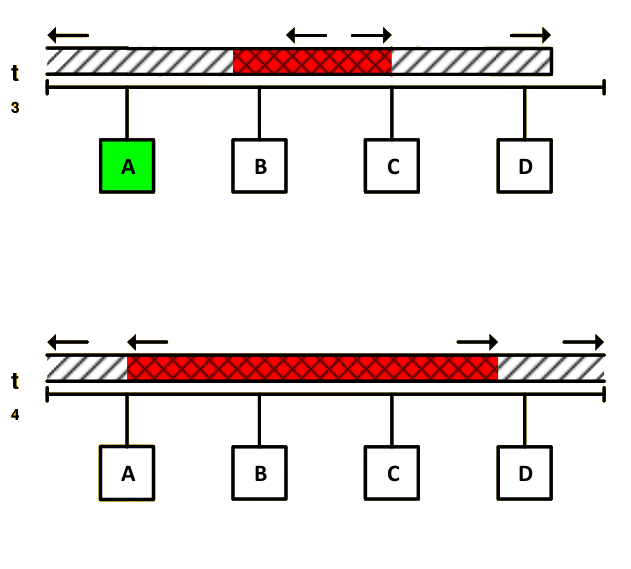
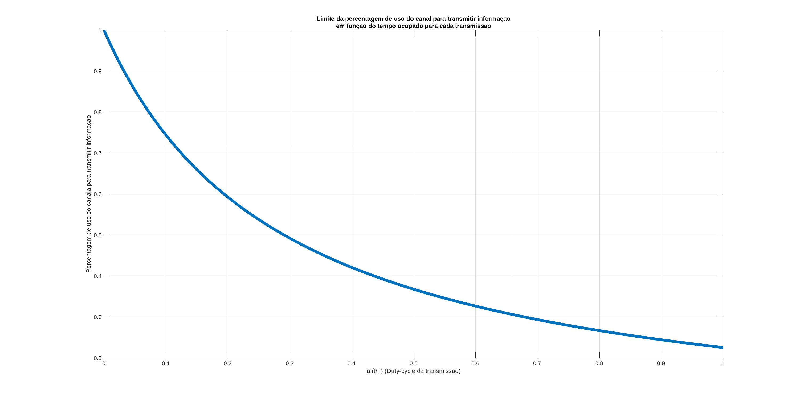

# Shared Media
- Múltiplos emissores e receptores partilham o mesmo canal de transmissão
- Existe **competição** pelo acesso ao meio
	- Não podem ser transmitidos no mesmo cabo dois pacotes ao mesmo tempo
	- É necessário existir coordenação entre os vários nós (tanto emissores como receptores)
- Requer mecanismos de **acesso múltiplo**

- classrooms:
	- a student raised the arm
	- the teacher decides
	- central control mechanisms

## ALOHA [^1]
- Sistema de transmissão de pacotes de rádio
- Cada estação transmite e recebe em diferentes frequências
- As estações transmitem **assim que possuam um pacote para enviar**, **independentemente do estado do canal**
	- Ocorrem colisões quando duas ou mais estações transmitem ao mesmo tempo

**Mecanismo de detecção e correção de colisões**

1. O emissor coloca a mensagem no meio partilhado
2. Se o receptor receber a mensagem corretamente, envia um `ACK`, indicando ao emissor que a mensagem foi corretamente recebida
3. Se após o intervalo de tempo o emissor	não receber o `ACK` do receptor (`timeout`), o emissor repete a transmissão do pacote
	- O `timeout` deve ser maior que o dobro do tempo de propagação (`round-trip delay`), para garantir que o pacote tem tempo para chegar ao receptor e o emissor tem tempo de receber o `ACK`
4. A retransmissão é efetuada após o emissor esperar um tempo aleatório, depois de ocorrer o `timeout`, 
	- Ao usar um tempo aleatório, a probabilidade de ocorrerem colisões repetidas é diminuída

O tempo de `timeout` tem de ser cuidadosamente escolhido:

- Demasiado lento: podem ocorrer situações em que o meio esteja sem uso, criando _delays_
- Demasiado rápido: o receptor pode não ter tempo para receber e enviar um `ACK`

A política de resolução das colisões é a **retransmissão**. Numa rede com taxas de ocupação elevadas, a performance deteriora-se, limitando a comunicação a um máximo de $\approx 20 \%$, devido aos mecanismos de colisão e retransmissão

[^1]: Desenvolvido na Universidade do Hawaii, para comunicar entre as ilhas

### Performance
Se considerarmos `g` a taxa máxima de transmissão de pacotes que o canal consegue suportar, então temos de garantir que $g > \lambda$, onde $\lambda$ é o número total de pacotes a transmitir. Esta condição garante que é possível retransmitir pacotes, devido às colisões ocorridas.

Considerando que um pacote, qualquer que seja, novo ou repetido, dura **T segundos** e chega ao destino no instante **$\Gamma$**:

- Para a **transmissão ser bem sucedida**, não pode existir nenhum outro pacote a usar o meio no intervalo de tempo
  $$[t-T, t + T]$$
  Este período de $2T$ corresponder ao tempo durante o qual o canal está vulnerável
- O `throughput`, i.e., a percentagem de tempo durante a qual o canal está a ser usado para comunicações bem sucedidas é:
  $$S = g \cdot T \cdot e^{-2gT} = G \cdot e^{-2G} \wedge G = g \cdot T$$
  onde $G$ representam o tráfico máximo no canal normalizado, ou seja, o número médio de pacotes oferecidos pelo período de transmissão.
- O melhor valor de `throughput` ocorre quando $G = 0.5$, ou seja, metade do tráfego possível e vale: $$S_{max} = \frac{1}{2} \cdot e^{-1} \approx 0.184$$
	

## CSMA (Carrier Sense Multiple Access)
Ao contrário do ALOHA, as estações **recebem e enviam pacotes no mesmo canal**. No entanto, **todas as estações** escutam o canal **antes de transmitir**.

Uma estação só começa a transmitir se detetar que o meio está livre. O objetivo é tentar impedir que existam duas comunicações simultâneas que irão colidir. Isto permite minimizar o número de colisões.

As colisões não são impedidas porque as estações estão separadas uma das outras, e portanto no mesmo instante duas estações podem começar a transmitir, se ambas virem o canal como desocupado. 

O tempo de propagação entre as estações faz com que estas não saibam se já existe outra ou não a transmitir/iniciar a transmissão. Assim, quando uma estação deteta que o meio está livre apenas deteta que não existe nenhum mensagem a chegar/passar por si.

### Collision Detection
A detecção de colisões permitir que mal seja detetada uma colisão, o emissor que a detetou para imediatamente a transmissão, para se puder retomar a transmissão de um pacote de cada vez

1. A estação A deteta que o meio está livre e começa a transmitir;
2. A estação B (quer transmitir), deteta que o meio está ocupado, e por isso não inicia a sua transmissão. A estação C, que não recebeu ainda o sinal do emissor A, quer transmitir e como deteta o meio como livre, inicia a transmissão;
3. Como estão dois sinais a ser transmitidos, irá ocorrer uma colisão. Primeiramente, o C deteta a colisão e retira-se da linha, deixando de transmitir. O B também deteta a colisão, mas como não está a transmitir, não faz nada;
4. Finalmente o sinal do emissor C é recebido pela estação A, que interrompe a sua transmissão.

- Devido a `round-trip delay`, para ser possível detetar uma colisão é necessário que a estação ainda esteja a transmitir após $$t_{min_{TX}} = 2 \times round\ trip\ delay$$
- É preciso que o emissor ainda esteja a emitir $2 \times round\ trip\ delay$. Assim, a informação mínima que têm de ser enviada para puder ser detetada uma colisão tem de representar $2 \tau$.
- O tempo máximo de propagação é entre os dois extremos da rede

 
### Performance
À  medida que o tráfego aumenta, o número de colisões também deverá aumentar.

A performance da CSMA/CD é dada por:
$$ S \underset{N \rightarrow \infty}{\rightarrow} \frac{1}{1 + 3.44 \cdot a}$$

onde $a = \frac{t}{T}$ e T representa o tempo de transmissão de um pacote. Sabemos ainda que $a < 1$>

## Ethernet
- A Ethernet usa CSMA/CD
- Inicialmente era um único cabo
	- cria problemas de acesso ao meio

- Tamanho mínimo do pacote: 64 bytes
	- depende da distância máxima entre duas estações, de modo a garantir que são detetadas colisões
- Tempo de espera estipulado
	- intervalo de tempo entre o fim de uma transmissão e o início da próxima
		- IFS - _Inter Frame Spacing_
	- Garante que as estações têm tempo de receber os dados e transitar para um estado estável
- Se o meio for detetado com ocupado, as estações ficam à escuta até que este esteja livre
	- Assim que estiver livre, enviam o seu pacote (isto após a inter frame spacing)
	- Protocolo: **1-persistent**
- Após detetar uma colisão, as estações aguardam um tempo aleatório até voltarem a retransmitir.
	- A taxa de transmissão mínima é 10 Mbit/s
	- O comprimento máximo de uma rede Ethernet é 2.5 km
- A janela não cresce acima de 2^10, tentamos 6 vezes. Depois, envia uma mensagem de erro indicando que `Media Not Available`

### Binary Exponential Backoff Algorithm
- Algoritmo para tratar das colisões
- Usa `time-slots` como referência
	1. Gera uma _pool_ contendo um número de `time-slots` reduzido
	2. Gera um valor aleatório dentro da _pool_ de `time-slots`
	3. Multiplica por $51.2 \mu s$ o valor obtido aleatoriamente da _pool_
	4. Obtém o delay a esperar em segundos
	5. Espero o delay e de seguida envio
		- Se tiver uma colisão, duplico a minha _pool_ de números de `time-slots`
		- Se tiver uma transmissão bem sucedida, reduzo para metade a _pool_ de números de `time-slots`
	6. Volto a repetir o número 1, com as novas especificações para o tamanho da pool
- O número de `slots` de espera para a N-enésima tentativa é dado por uma variável aleatória distribuída uniformemente na gama de valores:
	$$ 0 \leq r < 2^k, k = min(N, 10)$$
	- onde `N` é o número de tentativas e `k` é o número de tempos de espera para transmitir
- A duração de cada slot é $\frac{64 Bytes}{10 Mbps} = 51.2 \mu s$
- O número máximo de tentativas é 16
	- Ou seja, posso tentar reenviar 16 vezes o mesmo slot
- Quando existe pouco tráfego, as janelas são pequenas
- Quando há muito tráfico e muitas colisões, as janelas são grandes
- Poucas colisões: janela diminui e mantêm-se reduzida
- Não existe sincronismo na janela

**Problema:**

- Cria uma política LIFO
	 - Last In, First Out
	 - A estação que tenta transmitir mais, possui um número de tentativas maior, `N`, com um um número de espera maior, `k` tem uma delay maior na próxima tentativa
	 - Isto implica que demore mais tempo a ter acesso à rede
- Ou seja, não existe justiça no acesso ao meio

**Vantagem:**

- É eficiente para grandes variações de carga 

A probabilidade de um emissor receber um `back-off` quando acede à rede é:

`k`: Tamanho da janela    Probabilidade
-----------------------  ---------------
$2^1 = 2$						$50\%$
$2^2 = 4$						$75\%$
$2^3 = 8$						$87.5\%$
$2^4 = 16$						$93.75\%$
$2^5 = 32$						$96.88\%$
$2^6 = 64$						$98.44\%$
$2^7 = 128$						$99.22\%$
$2^8 = 256$						$99.61\%$
$2^9 = 512$						$99.80\%$
$2^10 = 1024$					$99.90\%$
$2^10 = 1024$					$99.90\%$
$2^10 = 1024$					$99.90\%$
$2^10 = 1024$					$99.90\%$
$2^10 = 1024$					$99.90\%$
$2^10 = 1024$					$99.90\%$

O atraso no acesso à rede depende da carga da rede:
- Até cerca de 1/3 de carga, a rede apresenta um `throughput` elevado
- Entre um terço a dois terços, a rede começa a ter problemas em resposta, como janelas progressivamente maiores e muitos `backoffs`
- Para uma carga superior a 2/3 da capacidade máxima da rede, a eficiência é demasiado baixo, existindo uma sobrecarga

 

