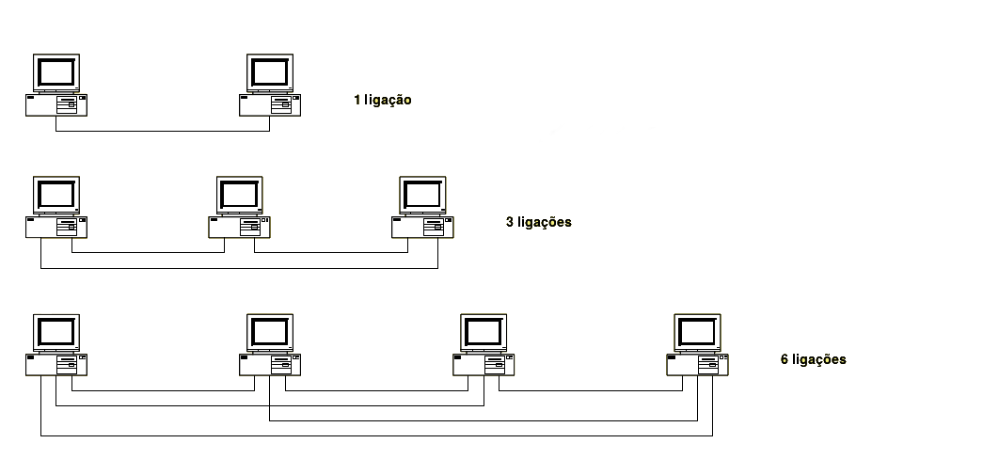
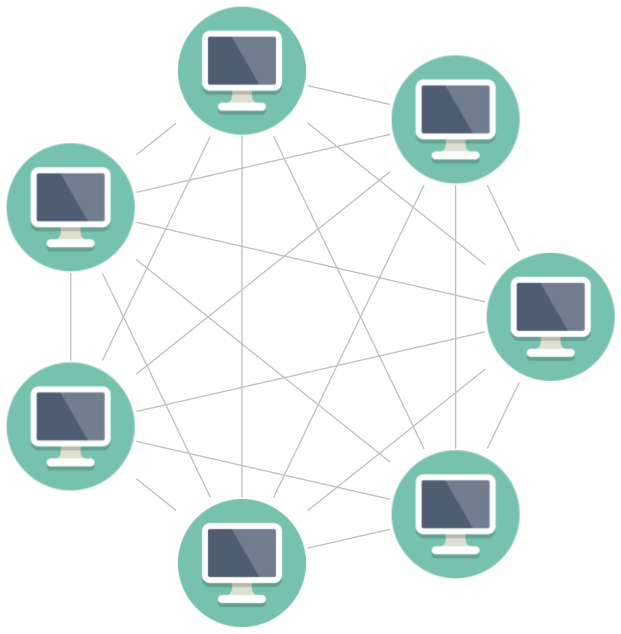
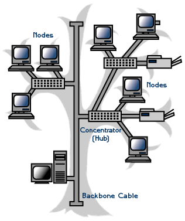
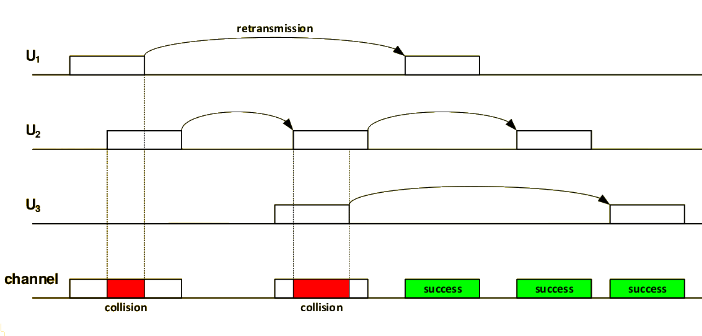
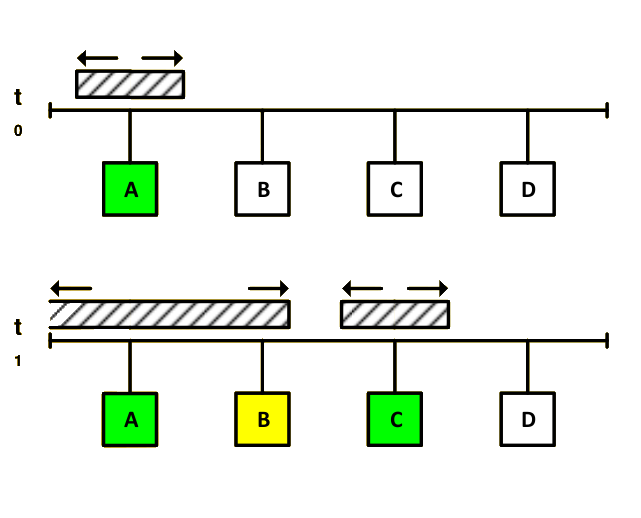
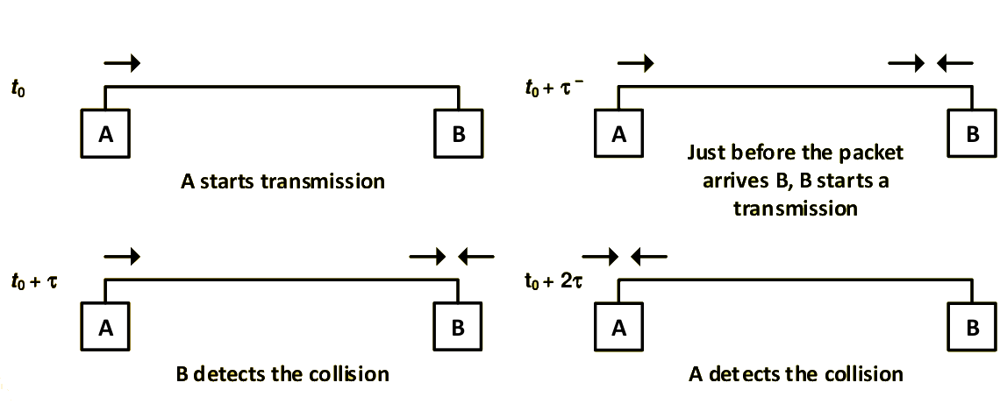
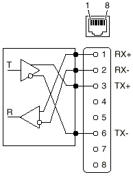
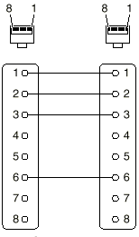
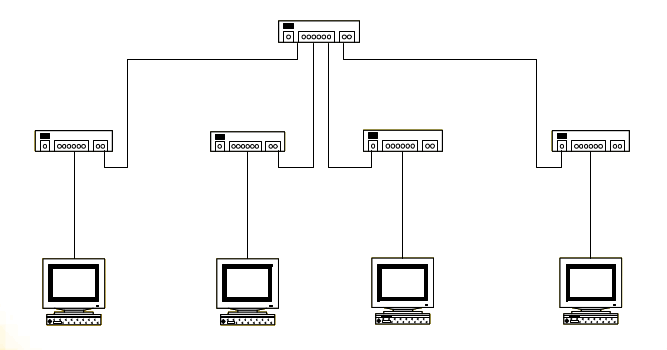

# Redes de Comunicação
São formadas principalmente por:

- Nós de switching
- Ligações ponto a ponto
- Equipamentos terminais
- Ligações partilhadas

## Ligações ponto a ponto
As ligações ponto a ponto representam uma **ligação física** entre dois dispositivos.

As ligações ponto a ponto trazem a vantagem de permitirem a otimização de cada conexão para cada estação específica. NO entanto, à medida que o número de estações envolvidas aumenta, o número de ligações físicas necessárias aumenta de forma exponencial

Se tivermos N nós, iremos precisar de $\frac{N^2 - N}{2}$ conexões, o que para valores de N elevados, se torna impossível.

- Cada estação que é adicionada implica establecer mais $N - 1$ ligações novas, ou seja, todas as existentes.
- Cada conexão necessita de um cabo e de $N -1 $ interfaces.
- **Não é escalável**

## Network topologies
As topologias da rede podem ser **lógicas** ou **físicas**, podendo coexistir em diferentes níveis, ou estarem misturadas no mesmo nível.

- A topologia pode referir-se aos cabos e interfaces ou como estão organizadas as entidades logicamente
- Em certas tipologias físicas, existe um melhor mapeamento da organização lógica com a física

Diferentes tipologias representam diferentes formas de **distribuir** e **partilhar  recursos**. Existem 4:

1. `mesh`
2. `bus`
3. `anel`_(ring)_
4. `estrela`_(star)_

### Mesh
Todos os nós estão ligados a todos os otros. Só é usada em redes de pequena dimensão, em que o número de nodos é reduzido.

Pela natureza do meio de comunicação, a rede wireless é `mesh`

Em ligações físicas por cabo/fibra, é usada redes com 4 a 6 nós, principalmente, redes com alto débito, por exemplo, links de fibra ótica com 10 Gbit por segundo, que interligam vários operadores.

**Vantagens:**

- Existem vários recursos disponíveis

**Desvantagens:**

- Rede complexa
- Rede difícil de gerir

### Bus
- A ligação física é um **único cabo**, **partilhado entre todos**
	- significa que se o cabo se estragar, a rede é destruída
- Qualquer terminal do cabo que não esteja ligado a nenhuma interface precisa de ser terminado propriamente.
	- Senão ocorrem reflexões
	- Removendo um nó da rede, é muito provável que a rede deixe de funcionar
- A rede pode ser aberta para inserir mais um nó, mas até o nó ser inserido fica inoperacional
- Exemplo:
	- Ethernet através de um cabo coaxial

**Vantagens:**

- Apenas usa um único cabo, o que facilita as ligações à rede

**Desvantagens:**

- Debug **muito difícil**
	- Partindo da extremidade da rede
		- Terminamos a rede da primeira interface
		- vemos se funciona
	- Vamos de computador em computador, terminal em terminal até descobrir o problema
		- não posso usar dividão binária

### Ring
- Todas as máquinas são conectadas em anel

**Vantagens:**

- O tempo de serviço e de resposta é determinístico
	- é possível determinar quanto tempo um pacote demora até ser recebido
- A rede é fácil de controlar
- O mecanismo de acesso ao meio é especificado e pode ser escolhido

**Desvantagens:**

- Se o cabo é cortado/desconectado, a rede morre
- Requer o uso de mecanismos de _failsafe_
	- Tipicamente são usados dois cabos, para o caso de um estar danificado
- Gestão da rede pode ser complexa
- Requer que o 1º nó da rede esteja ligado ao último

### Star network
- Todas as conexões são de 1 para 1, ou seja, ponto a ponto
- Qualquer problema que ocorra na rede é sempre local
	- Exlcuindo os problemas que afetem o hub
	- Se o hub morre, a rede morre
	- Se um cabo tiver problemas, só o cliente desse cabo é que sofre
- Implica usar um cabo por máquina, $N$
	- Mais cabos que para o bus ($1$)
	- Menos cabos que para a mesh ($N^2$)
	- Representa um **compromisso**
- As redes de um hoje são +- assim
- **Fisicamente**, as redes implementadas hoje em dia são redes em estrelas
- Exemplo: Ethernet UTP

**Vantagens:**

- Fácil Instalação
- Não existem falhas na rede sempre que um dos terminais é desconectado
- Fácil identificar falhas
	- Fácil remover elementos com falhas da rede
- Melhor perfomance que um bus

**Desvantagens:**

- Utiliza um elemento central para controlar a rede (`hub` ou `switch`)
	- _single point of failure_: se o `hub`/`switch` falha, a rede toda falha
- Mais cabos e maior custo que um bus

### Tree networks
- Estrutura em árvore
	- folhas representam os nós da rede
	- tronco representam a linha de comunicação principal de alto débito: `backbone cable`. Pode ser implementado com:
		-`ring` de fibra ótica
		-`high speed concentrator`
		-`bus`
	- em cada ramo existe uma rede em estrela
		- cada nó está ligado a uma rede em estrela localmente
- Atualmente, os ramos são redes em estrela inserido em redes em estrela
- O maior problema quando falamos desta redes são o cabo e os conectores

**Vantagens:**

- Conexão ponto a ponto nos segmentos individuais
- Se o hub morrer, a rede está segura
- Muito fácil de gerir

**Desvantagens:**

- O tamanho de cada segmento está limitado pelo tipo de cabo a usar
- Se o cabo principal ou o `concetrator` falhar, a area local falha
- Difícil configuração
- Difícil implementação física

# Shared Media
- Múlitplos emissores e recetores partilham o mesmo canal de transmissão
- Existe **competição** pelo acesso ao meio
	- Não podem ser transmitidos no mesmo cabo dois pacotes ao mesmo tempo
	- É necessário existir coordenação entre os vários nós (tanto emissores como recetores)
- Requer mecanismos de **acesso múltiplo**

- classrooms:
	- a student raised the arm
	- the teacher decides
	- central control mechanis,

## ALOHA [^1]
- Sistema de transmissão de pacotes de rádio
- Cada estação trasmite e recebe em diferentes frequências
- As estações transmitem **assim que possuam um pacote para enviar**, **independentemente do estado do canal**
	- Ocorrem colisões quando duas ou mais estações transmitem ao mesmo tempo

**Mecanismo de deteção e correção de colisões**

1. O emissor coloca a mensagem no meio partilhado
2. Se o recetor receber a mensagem corretamente, envia um `ACK`, indicando ao emissor que a mensagem foi corretamente recebida
3. Se após o intervalo de tempo o emissor	não receber o `ACK` do recetor (`timeout`), o emissor repete a transmissão do pacote
	- O `timeout` deve ser maior que o dobro do tempo de propagação (`round-trip delay`), para garantir que o pacote tem tempo para chegar ao recetor e o emissor tem tempo de receber o `ACK`
4. A retransmissão é efetuada após o emissor esperar um tempo aleatório, depois de ocorrer o `timeout`, 
	- Ao usar um tempo aleatório, a probabilidade de ocorrerem colisões repetidas é diminuída

O tempo de `timeout` tem de ser cuidadosamente escolhido:

- Demasiado lento: podem ocorrer situações em que o meio esteja sem uso, criando _delays_
- Demasiado rápido: o recetor pode não ter tempo para receber e enviar um `ACK`

A política de resolução das colisões é a **retransmissão**. Numa rede com taxas de ocupação elevadas, a perfromancedeteriora-se, limitando a comunicação a um máximo de $\approx 20 \%$, devido aos mecanismos de colisão e retransmissão

[^1]: Desenvolvido na Universidade do Hawai, para comunicar entre as ilhas

### Performance
Se considerarmos `g` a taxa máxima de transmissão de pacotes que o canal consegue suportar, então temos de garantir que $g > \lambda$, onde $\lambda$ é o número total de pacotes a transmitir. Esta condição garante que é possível retransmitir pacotes, devido às colisões ocorridas.

Considerando que um pacote, qualquer que seja, novo ou repetido, dura **T segundos** e chega ao destino no instante **$\Gamma$**:

- Para a **transmissão ser bem sucedida**, não pode existir nenhum outro pacote a usar o meio no intervalo de tempo
  $$[t-T, t + T]$$
  Este período de $2T$ corresponder ao tempo durante o qual o canal está vulnerável
- O `throughput`, i.e., a percentagem de tempo durante a qual o canal está a ser usado para comunicações bem sucedidas é:
  $$S = g \cdot T \cdot e^{-2gT} = G \cdot e^{-2G} \wedge G = g \cdot T$$
  onde $G$ representam o tráfico máximo no canal normalizado, ou seja, o número médio de pacotes oferecidos pelo período de transmissão.
- O melhor valor de `throughput` ocorre quando $G = 0.5$, ou seja, metade do tráfego possível e vale: $$S_{max} = \frac{1}{2} \cdot e^{-1} \approx 0.184$$
	

## CSMA (Carrier Sense Multiple Access)
Ao contrário do ALOHA, as estações **recebem e enviam pacotes no mesmo canal**. No entanto, **todas as estações** escutam o canal **antes de transmitir**.

Uma estação só começa a transmitir se detetar que o meio está livre. O objetivo é tentar impedir que existam duas comunicações simultâneas que irão colidir. Isto permite minimizar o número de colisões.

As colisões não são impedidas porque as estações estão separadas uma das outras, e portanto no mesmo instante duas estações podem começar a transmitir, se ambas virem o canal como desocupado. 

O tempo de propagação entre as estações faz com que estas não saibam se já existe outra ou não a transmitir/iniciar a transmissão. Assim, quando uma estação deteta qe o meio está livre apenas deteta que não existe nenhum mensagem a chegar/passar por si.

### Collision Detection
A deteção de colisões permitir que mal seja detetada uma colisão, o emissor que a detetou para imediatamente a transmissão, para se puder retomar a transmissão de um pacote de cada vez

1. A estação A deteta que o meio está livre e começa a transmitir;
2. A estação B (quer transmitir), deteta que o meio está ocupado, e por isso não inicia a sua transmissão. A estação C, que não recebeu ainda o sinal do emissor A, quer transmitir e como deteta o meio como livre, inicia a transmissão;
3. Como estão dois sinais a ser transmitidos, irá ocorrer uma colisão. Primeiramente, o C deteta a colisão e retira-se da linha, deixando de transmitir. O B também deteta a colisão, mas como não está a transmitir, não faz nada;
4. Finalmente o sinal do emissor C é recebido pela estação A, que interrompe a sua transmissão.

- Devido a `round-trip delay`, para ser possível detetar uma colisão é necessário que a estação ainda esteja a transmitir após $$t_{min_{TX}} = 2 \times round\ trip\ delay$$
- É preciso que o emissor ainda esteja a emitir $2 \times round\ trip\ delay$. Assim, a informação mínima que têm de ser enviada para puder ser detetada uma colisão tem de representar $2 \tau$.
- O tempo máximo de propagação é entre os dois extermos da rede

 
### Performance
À  medida que o tráfego aumenta, o número de colisões também deverá aumentar.

A performance da CSMA/CD é dada por:
$$ S \underset{N \rightarrow \infty}{\rightarrow} \frac{1}{1 + 3.44 \cdot a}$$

onde $a = \frac{t}{T}$ e T representa o tempo de transmissão de um pacote. Sabemos ainda que $a < 1$>

## Ethernet
- A Ethernet usa CSMA/CD
- Inicialmente era um único cabo
	- cria problemas de acesso ao meio

- Tamanho mínimo do pacote: 64 bytes
	- depende da distância máxima entre duas estações, de modo a garantir que são detetadas colisões
- Tempo de espera estipulado
	- intervalo de tempo entre o fim de uma transmissão e o início da próxima
		- IFS - _Inter Frame Spacing_
	- Garante que as estações têm tempo de receber os dados e transitar para um estado estável
- Se o meio for detetado com ocupado, as estações ficam à escuta até que este esteja livre
	- Assim que estiver livre, enviam o seu pacote (isto após a inter frame spacing)
	- Protocolo: **1-persistent**
- Após detetar uma colisão, as estações aguardam um tempo aleatório até voltarem a retransmitir.
	- A taxa de transmissão mínima é 10 Mbit/s
	- O comprimento máximo de uma rede Ethernet é 2.5 km
- A janela não cresce acima de 2^10, tentamos 6 vezes. Depois, envia uma mensagem de erro indicando que `Media Not Available`

### Binary Exponential Backoff Algorithm
- Algoritmo para tratar das colisões
- Usa `time-slots` como referência
	1. Gera uma _pool_ contendo um número de `time-slots` reduzido
	2. Gera um valor aleatório dentro da _pool_ de `time-slots`
	3. Multiplica por $51.2 \mu s$ o valor obtido aleatoriamente da _pool_
	4. Obtém o delay a esperar em segundos
	5. Espero o delay e de seguida envio
		- Se tiver uma colisão, duplico a minha _pool_ de números de `time-slots`
		- Se tiver uma transmissão bem sucedida, reduzo para metade a _pool_ de números de `time-slots`
	6. Volot a repetir o número 1, com as novas especificações para o tamanho da pool
- O número de `slots` de espera para a N-enésima tentativa é dado por uma variável aleatória distribuída uniformemente na gama de valores:
	$$ 0 \leq r < 2^k, k = min(N, 10)$$
	- onde `N` é o número de tentativas e `k` é o número de tempos de espera para transmitir
- A duração de cada slot é $\frac{64 Bytes}{10 Mbps} = 51.2 \mu s$
- O número máximo de tentativas é 16
	- Ou seja, posso tentar reenviar 16 vezes o mesmo slot
- Quando existe pouco tráfego, as janelas são pequenas
- Quando há muito tráfico e muitas colisões, as janelas são grandes
- Poucas colisões: janela diminui e mantêm-se reduzida
- Não existe sincronismo na janela

**Problema:**

- Cria uma política LIFO
	 - Last In, First Out
	 - A estação que tenta transmitir mais, possui um número de tentativas maior, `N`, com um um número de espera maior, `k` tem uma delay maior na próxima tentativa
	 - Isto implica que demore mais tempo a ter acesso à rede
- Ou seja, não existe justiça no acesso ao meio

**Vantagem:**

- É eficiente para grandes variações de carga 

A probabilidade de um emissor receber um `back-off` quando acede à rede é:

`k`: Tamanho da janela    Probabilidade
-----------------------  ---------------
$2^1 = 2$						$50\%$
$2^2 = 4$						$75\%$
$2^3 = 8$						$87.5\%$
$2^4 = 16$						$93.75\%$
$2^5 = 32$						$96.88\%$
$2^6 = 64$						$98.44\%$
$2^7 = 128$						$99.22\%$
$2^8 = 256$						$99.61\%$
$2^9 = 512$						$99.80\%$
$2^10 = 1024$					$99.90\%$
$2^10 = 1024$					$99.90\%$
$2^10 = 1024$					$99.90\%$
$2^10 = 1024$					$99.90\%$
$2^10 = 1024$					$99.90\%$
$2^10 = 1024$					$99.90\%$

O atraso no acesso à rede depende da carga da rede:
- Até cerca de 1/3 de carga, a rede apresenta um `throughput` elevado
- Entre um terço a dois terços, a rede começa a ter problemas em resposta, como janelas progressivamente maiores e muitos `backoffs`
- Para uma carga superior a 2/3 da capacidade máxima da rede, a eficiência é demasiado baixo, existindo uma sobrecarga

 

# Token Ring
O mecanismo utilizado é diferente da CSMA/CD

A rede é vista como um **anel de estações** e o **acesso ao meio** é baseado num `token`.

- Só quem tem o `token` é que pode enviar o pacote
- Se uma máquina/`node` receber o `token` e não quiser enviar nada, passa o `token` à seguinte
- Se nenhuma máquina/estação/nó quiser enviar dados, o `token` circula entre elas até que uma delas tenha algo para enviar

Quando uma estação possui um pacote pronto a transmitir, **espera** pela **receção do `token`**. De seguida:

- Remove o `token` da rede
- Envia o pacote que pretende transmitir
	- Uma vez que o `token` já não circula e uma estação só pode enviar pacotes na presença do `token`, não vão ocorrer colisões
- O pacote circula a rede
	- É lido pelo destinatário
	- O destinatário indica, usando um bit de flag, que a mensagem foi lida
	- Volta ao emissor, que o remove da rede
- Após o pacote circular, o `token` é enviado, permitindo a outras estações transmitir 
- Não existe _acknowledge_

Uma rede `token ring` possui um tempo de espera determinístico. No máximo, o tempo de espera será 
$$N \times (tempo\ máximo\ da\ mensagem + tempo\ de\ passagem\ do\ token)$$
onde N são o número de estações exisitentes

Existe uma estação responsável por **monitorizar** a rede `active monitor`. As suas principais funcionalidades são:

- Impedir pacotes de circular pela rede infinitamente
	 - Ao passar pela **estação monitora**, esta transmite o pacote a jusante de si com o bit M a 1
	 - Se um pacote passar pela estação monitora com o bit M a 1, é removido do `ring`
	 - Pode ocorrer se o emissor enviar um pacote e em seguida "desaparecer" da rede
- Detetar ausência de `token` na rede
	- A **estação monitora** mantêm um `timer`
	- Sempre que o `token` passa pela estação, o `timer` sobre um reset
	- Se o `timer` esgotar o seu intervalo de contagam, um novo `token` é introduzido no anel
- Detetar se existe algum monitor no `ring`:
	- envia periodicamente uma `frame`: `active-monitor-present`
	- Cada estação mantém um `timer` 
		- atualizado/reset cada vez que um `frame` é recebido
	- O monitor pode ser qualquer uma das estações
	- Quando o `timer` expira, occorre processo para eleger um novo monitor
		- É escolhida a estação com maior endereço

No `Token Ring`, tudo é baseado em `timers`

- Se este tipo de sinalização não aparecer, alguma estação toma  ainiciativa
- É escolhido com base no endereço da máquina

Podem existir endereços `multicast` numa rede `Token Ring`. Basta que pacotes IP `multicaste` sejam enviados por uma rede em `Token Ring`. Apenas é necessário que exist algo que efetue o mapeamento dos endereços IP `multicast` no endereço MAC na rede `token-ring`

**Vantagens:**

- A rede opera à sua máxima capacidade
- Não existem colisões
- O tempo de um serviço (emissão, receção) é **determinístico**

	
Protocolo Ethernet IEEE 802.3

## Token-Ring vs Ethernet

### Desvantagens do _Token-Ring_
1. É preciso garantir que o `token` é mantido na rede
	- Implica nomear uma estação, que:
		- assegure que existe **apenas 1 `token`**
		- substitua o `token-ring`, se necessário
2. Se o tráfego na rede for reduzido, as estações são **obrigadas a esperar pelo `token`**
	- Numa rede Ethernet, com baixa carga, as transmissões podem ser **imediatamente**

### Vantagens do _Token-Ring_
1. Se a rede estiver com bastante ocupada, o `token` introduz na rede uma política de acesso `round-robin`
	- Garante eficiência e justiça no acesso ao meio
	- Na Ethernet, com demasiada carga na rede, a utilização e acesso ao meio pelas estações é ineficiente devido ao elevado número de colisões netre pacotes

# Ethernet Evolution

## 10Base5
- Primeira tecnologia Ethernet
- Taxa de transmissão: 10 Mb/s
- Cabo coaxial grosso, $75 \Omega$ (_thick Ethernet_)
	- geralemnte amarelo
- Comprimento máximo do cabo = 500 m
- As estações conectavma-se á rede através de um _ransceiver_
- A interfacece entre as estações e o respetivo _ttransceiver_ é efetuada usando uma `AUI`
	 - `AUI`: Attachment Unit Interface
	 - Um cabo `AUI` podia ter no máximo um comprimento de 50 m
	 - A distância entre estações devia ser um múltiplo de 2.5m, para **evitar reflexões**
- O número máximo de estações permitidas são 100

### Limitações
Através da imagem \label{ethernet_transmission}, temos de garantir que todos os transmissores conseguem detetar colisões entre dois ou mais pacotes na rede. Isto impõe um **tamanho mínimo ao pacote**.

Para a configuração máxima, apresentada na figura \label{ethernet_10Base5_network}, usando cabos com o comprimento máximo de 50 m, e tendo em conta que o `round-trip delay` é de $52 \mu s$, podemos concluir que:

- o tamanho mínimo do pacote a ser transmitido possui 64 bytes
	- se o pacote possui menos dados $\implies$ _padding_ com '0'
- Os sinais/pacotes não podem ultrapassar mais do que:
	- **5 segmentos de cabo**
	- **4 repetidores**

## 10Base2
- Taxa de transmissão: 10 Mb/s
- Cabo coaxial fino, $50 \Omega$ (_thin Ethernet_)
- Comprimento máximo do cabo = 185 m
- As estações conectavma-se á rede/cabo através de um conector BNC
	 - A distância mínima entre devia ser 0.5m, para **evitar reflexões**
- O número máximo de estações permitidas por segmento são são 30
- Os segmentos tinham de ser interligados por um repetidor

## 10BaseT
- Primeiro protocolo estruturado
- Taxa de transmissão: 10 Mb/s
- Twisted Pair Winding (Cabo entraçado)
	- Pode ser `UTP` ou `STP`
		- `UTP`: Unshielded Twisted Pair
		- `STP`: Shielded Twisted Pair
- Comprimento máximo do cabo UTP = 100 m
- As estações conectava-se diretamente a um repetidor (`hub`), através de um cabo UTP
	- Conectores RJ-45
	- O cabo podia ter no máximo um comprimento de 100 m
- A rede física consistia num conjunto de cabos partilhados, onde todos os utilizadores partilha o mesmo meio físico
- Logicamente, a implementação é uma `star network`
	- **Mas não Fisicamente!**

### Hub operation
- Um hub é um repetidor que opera na camada física, efetuando o `broadcast` da informação de todas as portas para todas as portas

### Conectores RJ-45

#### Terminal Equipment

- Equipamento terminal são pcs ou routers
- **Pinos transmissão:** 1 e 2
- **Pinos receção:** 3 e 6 

#### Network Equipment

- Equipamento da rede são hubs e switchs
- **Pinos transmissão:** 3 e 6
- **Pinos receção:** 1 e 2 

### Cabos UTP
- Definição da Norma EIA/TIA-568B RJ-45:
	- **Par #1:** Branco/Azul + Azul
	- **Par #2:** Branco/Laranja + Laranja
	- **Par #3:** Branco/Verde + Verde
	- **Par #4:** Branco/ Castanho + Castanho
-  10BaseT apenas usa os **pares 2 e 3 (laraja e verde)**
	- **Par #2** é ligado aos pinos **1** e **2**
		- Pino 1: Branco/Laranja
		- Pino 2: Laranja
	- **Par #3** é ligado aos pinos **3** e **6**
		- Pino 3: Branco/Verde
		- Pino 6: Verde
- Restantes pares:
	- Par #1
		- Pino 4: Azul
		- Pino 5: Branco/Azul
	- Par #4
		- Pino 7: Branco/Castanho
		- Pino 8: Castanho

#### Categorias UTP: Unshielded Twisted Pair
Categoria  Descrição
--------- ---------------------------------------------
1          Apenas voz (cabo telefónico)
2          Dados até 4 Mb/s (LocalTalk)
3          Dados até 10 Mb/s (Ethernet)
4          Dados até 20 Mb/s (16 Mbps Token Ring)
5 (a/e)    Dados até 100 Mb/s (Fast Ethernet)
6 (a)      Dados até 1Gb/s (ou 10Gb/s) (GigabitEthernet)

#### Direto vs Cruzado

Ao usar um cabo cruzado, o pinout deve mudar em **apenas uma das portas**

- Par #2 é ligado aos pinos 1 e 2:
	- Pino 1: Branco/Verde
	- Pino 2: Verde
- Par #3 é ligado aos pinos 3 e 6:
	- Pino 3: Branco/Laranja
	- Pino 6: Laranja

Atualmente os dispositivos conseguem fazer o switch interno e perceber se foram ligados com um cabo direto ou cruzao.

## Categorias da Ethernet tradicional
Em resumo:

# Conexões entre hubs

## Cascata
- Permite a extensão da rede 
	- apenas até 4 hubs

## Estrela
- Cada Hub conecta-se a um `hub` central
- Permite a criação de redes em estrela de redes em estrela

## Conexões entre hubs - porta de `uplink`
A conexão entre `hubs` é efetuada usando uma porta especial: a porta de `uplink`. A porta de `uplink` serve apenas para ligar diretamente hubs, usando um **cabo direto**

A porta de uplink está configurada para receber nos pinos 1 e 2 e transmitir nos pinos 3 e 6.
Útil uma vez que os vários pinos do `hub` podem funcionar a diferentes frequências

# Fast Ethernet e Gigabit Ethernet
> Como tornar a Ethernet 10x mais rápida? $10 Mb/s \rightarrow 100 Mb/s$

Continuamos a ter o problema do `round-trip delay`

Soluções:

1. Aumentar 10x o tamanho mínimo do pacote
2. Diminuir 10x o tamanho mínimo da rede
3. Combinação dos pontos (1) e (2)
4. Permitir que ocorram colisões sem serem detetadas

Fast Ethernet (100 Mb/s) $\rightarrow$ reduzir o tamanho da rede
Gigabit Ethernet (10 Gb/s) $\rightarrow$ reduzir o tamanho da rede e aumentar o tamanho mínimo do pacote para 512 bytes. 

- Limitou-se o comprimento máximo do cabo a 10 m 
- Os octetos nos campos protocolo deixaram de ser apenas octetos (mais bits)
- Os pacotes mais pequenos sofrem extensão da `carrier`
- Quando vários pacotes pequenos precisam de ser transmitidos, podem ser transmitidos `back-to-back`
	- O primeiro pacote tem de ser extendido para ocupar 512 bytes

## Implementações de Fast Ethernet
- **100Base-Tx:** 2 cabos UTP - categoria 5
- **100Base-Fx:** 2 cabos de fibra ótica
- **100base-T4:** 4 cabos UTP - categoria 3

## Implementações de Gigabit Ethernet
- **1000Base-SX:** 2 cabos fibra ótica - _short wavelength_
- **1000Base-LX:** 2 cabos fibra ótica - _long wavelength_
- **1000Base-CX:** 2 cabos STP
- **1000Base-T:** 4 cabos UTP

O cabo é cerca de 2/3 mais lento que a fibra ótica
# LLC: Logical Link Control

No IEEE 802, a camada de ligação lógica (nível 2) está dividida em 2 camadas

1. MAC - Medium Access Control
2. LLC

## MAC
- Responsável pela formação das tramas
	- Endereço de origem 
	- Endereço de destino
	- Deteção de erros
- Deteção e Receção das tramas
- Controlo de acesso ao meio
	- protocolo CSMA/CD

## LLC
- multiplexagem de fluxos de diferentes serviços da camanda protocolar superior
- Contém os campos:
	- `DSAP`: _Destination Service Access Point_
		- Identifica o serviço na estação de destino a que se destina a trama
	- `SSAP`: _Source Service Access Point_ 
		- identifica o serviço na estação origem que enviou a trama
	- `CTL`: Byte de controlo
		- entre outras coisas, pode ser usado para numerar as tramas

