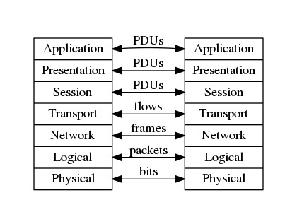
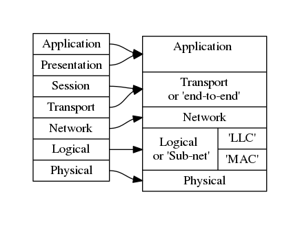

# Modelos OSI
- A comunicação entre duas entidades distintas exige que:
	- as entidades aceitem regras e protocolos de comunicação
	- Existam regras que sejam _standard_
	- Todas as entidades reconheçam e apliquem estas regras
- A comunicação deve respeitar algumas funcionalidades:
	- Controlar acessos e a utilização do meio
	- Identificação correta do emissor e do recetor
	- `Routing` adequado da informação
	- Garantias que a informação é entregue ao destinatário
	- Deteção de erros

\begin{figure}
\includegraphics[width=0.3\textwidth]{pictures/OSI_model.png}
\caption{OSI Model}
\end{figure}

- **OSI:** Open Systems Interconnect
- **ISO:** International Standards Organization

Um sistema possui as segyintes camadas, organizada por funções:

- Transporte de informação através da rede:
	- Transporte
	- Network
	- Logical
	- Physical
- Interação enter as diferentes funcionalidades da rede
	- Application
	- Presentation
	- Session
Vantagens:

- Modular
- Flexivel
- Bem estruturada

- Complexa
- Demasiado overhead causo pelo elevado número de camadas
- Falta de aplicabilidade prática

## Physycal Layer
- Transdutor elétrico: transforma os bits em sinais físicos (elétricos, óticos ou ondas rádio
	- Colocar os sinais físicos no respetivo meio de transmisão
	- Recebe os sinais elétricos do meio de transmissão e 
- Sincroniza a informação recebida
	- Independemente do que está a ser transmitido, recebemos sempre "alguma coisa"
	- É preciso detetar se esse sinal corresponde a ruído ou informação
- Define o tamanho máximo dos pacotes e os conectores
- Impõe as restrições físicas ao sistema
- Em larga escala, é o fator mais importante do custo

Bitrate do Wifi:

- Depende da norma (wifi standards)
- da potência do sinal
- Usa OFDM
- Usa bits de controlo para identificar o início e o fim das mensagens
- RS232 é banda base
- SFD: Start Frame Delimitr
- Preamble: Saber a que velocidade estou:
	- Envio uma sequência de relógio e usando uma PLL faço a extração do relógio e sincronizo

## Logical Layer
- Assegura que existe uma partilha justa dos recursos pelas diferentes estações
- Identifica as entidades envolvidas
- Direciona a infromação entre as máquinas das rede
- Serve de interface com a Network Layer

## Network Layer
- **Network identification:** Permite identificar diferentes máquinas em diferentes domínios lógicos
- Interliga diferentes redes
- Define caminhos de interligação entre diferentes redes
- Reencaminha pacotes entre diferentes redes

## Tansport Layer
- Assegura a ligação entre dois pontos da rede
- Pode ser usada para estabelecer uma conexão
- É nesta camada que são efetuadas as ligações ponto a ponto
- Garante certas funcionalidades da conexão
	- e.g.: _packet reordering_
- Controla o uso da rede de forma eficiente
	 e.g.: previne a congestão da rede

## Outras Camadas
- Sessions
	- Estabelece a relação de sessões entre conexões partilhadas pela mesma funcionalidade
- Presentation
	- Encripação
	- Segurança
	- Confidencialidade
- Application
	- A Aplicação/funcionalidade que requer a comunicação

# PDUs, SDus e SAPs
- Cada camada funciona adicionando um header à mensagem
	- Causa grande overhead
- Cada camada transporta um pacote de dados da camada acima e usa os recursos de comunicação da camda abaixo
- Cada camada comunica logicamente com a mesma layer no recetor

- **PDUs:** Protocol Data Unit
- **SDU:** Service Data Unit
- **SAP:** Service Access Point
 
# Comunicação Peer-to-peer

# Sistema Intermédio

# A falat de sucesso do modelo OSI
- Os protocolos demoraram demasiado tempo para serem concluídos
- Foi difícil obter uma cópia dos documentos que descrevem os protocolos
- Protocolos difíceis de implementar
	- X.400
	- X.500
	- FTAM
	- CLNP
	- X.25
	- CMIP
	- ES-IS
	- IS-IS
- Estrutura demasiado complexa para o equipamento da altura

# TCP-IP vs OSI
O modelo TCP-IP substituiu o modelo OSI, por ser **mais simples**, **menos complexo** e **mais abstracto**.

- Vantagens:
	- **Menos Níveis:**
		- A `Presentation Layer` está incluída na `Application Layer`
		- A `Session Layer`e a `Transport Layer` estão fundidas numa única, representando `End-to-End`
	- Um único nível de Internet (i.e., de redes interconectadas), que é orientado ao `connectionless`
		- Simples e mais eficiente
	- O nível `sub-network` é deixado indefinido de forma propositada. Pode ser:
		- Uma conexão `point-to-point` 
		- Uma rede complexa com `internal switching`
		- Na prática é considerado que é uma rede que usa a tecnologia IEEE 802.x
	- Focado numa perspectiva `end-to-end`
		- A estrutura interna da rede é **muito mais simples**
	

# Princípios dos Modelos da Internet
- End-to-end
	- Remove a complexidade das camadas inferiores da rede para as camadas superiores da rede
	- Os nós intermédios da rede ficam mais simples
- Simplificação
	- Apenas 5 níveis
- Conection-less network level
	- Cada pacote possui informação da origem e destino
	- Fácil de implementar sobre o meio físico
- Protocolos flexíveis na camada de transporte
	- TCP 
	- UDP
	- cumpriam tudo o que era necessário na altura

